# Bedienungsanleitung SVA-Fencing-Tester

> **VORABFASSUNG** – Diese Dokumentation befindet sich in Arbeit. Angaben zu Gehäuse, Bildern, Screenshots, finalem FIE-Preset und Compliance-Nachweisen werden mit den jeweiligen Freigaben ergänzt.

> Die Firmware und gerätespezifische Webapp sind proprietär. Verwendete Drittanbieter-Komponenten und ihre Lizenzen sind separat dokumentiert.

## 1. Über dieses Dokument

Diese Bedienungsanleitung beschreibt die sichere Inbetriebnahme, Bedienung und bestimmungsgemäße Verwendung des SVA-Fencing-Testers. Im Mittelpunkt steht die Bedienung direkt am Gerät. Zusätzlich wird beschrieben, wie das Gerät über eine Weboberfläche im Browser auf dem Smartphone, Tablet oder Computer angezeigt und bedient werden kann.

Zielgruppe:

- Anwender im Bereich Fechtsport, Service, Wartung und Prüftechnik
- Personen, die im Verein Leitungen (Körperkabel, Maskenkabel, Rollen), Waffen oder Westen prüfen.
### 1.1 Rechtlicher und organisatorischer Hinweis

Der SVA-Fencing-Tester ist ein privat und ehrenamtlich entwickeltes Projekt zur gezielten Unterstützung des Fechtsports. Die Bereitstellung und Weitergabe erfolgen vollständig auf Non-Profit-Basis und ohne Gewinnerzielungsabsicht, um Vereinen eine erschwingliche und hochpräzise Materialpflege zu ermöglichen.

Hinweise zum Urheberrecht und Eigentumsschutz:

Die integrierte Firmware sowie die gerätespezifische Webapp sind geistiges Eigentum des Entwicklers und strikt Closed-Source.

Jede Form der unbefugten Vervielfältigung, Modifikation, Dekompilierung (Reverse Engineering) oder des unerlaubten Kopierens der Programmdaten ist ausdrücklich untersagt.

Das Produkt ist kein industriell seriengefertigtes Messgerät, sondern ein im privaten Ehrenamt entstandenes Werkzeug für die vereinsinterne Praxis.

Es wird nach bestem Wissen und Gewissen auf Basis jahrelanger praktischer Erfahrungen an der Planche bereitgestellt.

Die Nutzung des Geräts sowie die daraus abgeleiteten Reparaturentscheidungen erfolgen vollständig eigenverantwortlich durch den Anwender.

### 1.2 Hinweis zu Regelwerken und Grenzwerten

Der Tester unterstützt mit einem nicht am Gerät veränderbaren FIE-Preset die elektrische Materialprüfung anhand der vorgesehenen Prüfparameter. Aktualisierungen des Presets erfolgen kontrolliert über die Webapp; bei aktivem Preset zeigt das Gerät das FIE-Logo. Der Tester ist ein Materialtester, keine Meldeanlage und keine Trefferanzeige. Eine formale Aussage zur FIE-Konformität wird erst nach abgeschlossenem, separat dokumentiertem Nachweis veröffentlicht.

### 1.3 Garantie, Gewährleistung und Haftung

Sofern nicht zwingende gesetzliche Vorschriften etwas anderes verlangen, gilt:

- Es wird keine Garantie für bestimmte Eigenschaften, Verfügbarkeit oder Eignung für einen bestimmten Zweck übernommen.
- Es wird keine darüberhinausgehende Gewährleistungszusage abgegeben.
- Für direkte oder indirekte Schäden, Folgeschäden, Datenverlust, Fehlmessungen oder daraus abgeleitete Entscheidungen wird keine Haftung übernommen, soweit gesetzlich zulässig.
> **Wichtig:**

- Der Anwender bleibt für den sachgerechten Einsatz und die Bewertung der Messergebnisse verantwortlich.
- Das Gerät unterstützt die Prüfung, ersetzt aber nicht die fachliche Beurteilung des Anwenders.
### 1.4 Abkürzungen und Fachbegriffe

Dieses Kapitel erklärt wichtige Begriffe aus dem weiteren Verlauf der Bedienungsanleitung.

#### 1.4.1 Wichtige Abkürzungen

- ADC: Analog-to-Digital Converter (Analog-Digital-Wandler; integrierter Schaltkreis zur Umsetzung analoger Messspannungen in digitale Zahlenwerte).
- AP: Abkürzung für Access Point. Das Gerät stellt dabei selbst ein WLAN bereit.
- BMP: einfaches Bilddateiformat, hier genutzt für Bildschirmfotos von Geräteoberfläche.
- BOM: Bill of Materials (Stückliste; Verzeichnis aller elektronischen und mechanischen Bauteile, die für die Bestückung der Platine benötigt werden).
- CRA: Cyber Resilience Act (Europäische Cyberresilienz-Verordnung für Produkte mit digitalen Elementen).
- DHCP: automatische Vergabe der Netzwerkadresse.
- DSO: Daylight Saving Time (Sommerzeit; Status-Flag zur kosmetischen Zeitumstellung im Benutzerinterface, synchronisiert über den Browser).
- DST: automatische Vergabe der Netzwerkadresse.
- EMV: Elektromagnetische Verträglichkeit (Fähigkeit eines Apparates, in seiner elektromagnetischen Umwelt zufriedenstellend zu arbeiten, ohne selbst unzulässige Störungen zu verursachen).
- ESD: Electrostatic Discharge (Elektrostatische Entladung; hochenergetische Spannungsdurchschläge, die durch Schutzdioden direkt an den Buchsen abgefangen werden).
- FIE: Internationaler Fechtverband.
- FPU: Floating Point Unit (Gleitkommaeinheit; dedizierter mathematischer Co-Prozessor im Hauptchip zur schnellen Berechnung ratiometrischer Messwerte in Echtzeit).
- FRAM: Ferroelectric Random Access Memory (Ferroelektrischer Zufallsspeicher; extrem langlebiger, magnetischer Datenspeicher für verschleißfreie Sicherung der Live-Parameter).
- GND: Ground (Masse; das gemeinsame Bezugspotenzial der elektrischen Schaltung).
- Heap: Dynamischer Speicherbereich (Teil des RAMs, aus dem die Software zur Laufzeit flexibel Speicher für JSON-Objekte, Web-Clients oder temporäre Puffer anfordert).
- IP-Adresse: Zahlenadresse, unter der ein Gerät im Netzwerk erreichbar ist.
- I²C: Inter-Integrated Circuit (Serieller Datenbus zur internen Kommunikation zwischen dem Hauptprozessor, den Messwandlern und der Echtzeituhr).
- JSON: Dateiformat für gespeicherte Einstellungen und Konfigurationen.
- LittleFS: Little File System (Robustes, stromausfallsicheres Dateisystem im internen Speicher; dient zur Verwaltung der geräteunabhängigen Webapp-Dateien).
- mDNS: Aufruf eines Geräts über einen Namen statt über eine Zahlenadresse.
- MUX: Multiplexer (Elektronischer Umschalter, der die lastfreien Messspannungen hochohmig an die Wandlerstufen leitet).
- NOK: Not OK (Nicht in Ordnung; Fehlerzustand bei Grenzwertüberschreitung oder Signalabriss).
- NTP: Network Time Protocol (Netzwerkzeitprotokoll; wird in diesem System aufgrund der bewussten Offline-Architektur nicht verwendet).
- OTA: Firmware-Update über WLAN und Browser, ohne das Gerät zu öffnen.
- PCB: Printed Circuit Board (Leiterplatte / Platine; der mechanische Träger und elektrische Verbinder der elektronischen Bauteile).
- PGA: Programmable Gain Amplifier (Programmierbarer Signalverstärker; sorgt im ADC für die automatische, feinstufige Bereichsanpassung bei kleinsten Spannungen).
- PWM: Pulsweitenmodulation (Digitales Modulationsverfahren; steuert hier die stufenlose Lautstärke des Signalgebers sowie die Helligkeit des Bildschirms).
- PSRAM: Pseudo-Static Random Access Memory (Pseudostatischer Arbeitsspeicher; externer, über die SPI-Schnittstelle angebundener RAM-Speicher zur Bereitstellung des großen Display-Framebuffers).
- RAM: Random Access Memory (Flüchtiger Arbeitsspeicher; schneller Hauptspeicher des Mikrocontrollers für Programmdaten und Variablen, aufgeteilt in schnellen internen SRAM und externen PSRAM).
- RED: Radio Equipment Directive (Europäische Funkanlagenrichtlinie 2014/53/EU; regelt die Marktzulassung von Funkkomponenten).
- REST-API: Representational State Transfer Application Programming Interface (Schlanke Programmierschnittstelle; der einzige offene Netzwerk-Port zur sicheren Datenkommunikation).
- RTC: Real-Time Clock (Echtzeituhr; autarker, batteriegepufferter Uhrenbaustein zur exakten Zeithaltung).
- SPI: Serial Peripheral Interface (Serielle Peripherieschnittstelle; schneller, synchroner Datenbus zur hardwarenahen Ansteuerung des TFT-Displays und des PSRAMs).
- SPS: Samples Per Second (Messwerte pro Sekunde; Maßeinheit für die Abtastgeschwindigkeit der analogen Messstufen).
- SPIFFS: SPI Flash File System (Separiertes, geschütztes Dateisystem für benutzerdefinierte Konfigurationsdateien, Presets und Logos).
- SVG: Scalable Vector Graphics (Skalierbare Vektorgrafik; zweidimensionales Grafikformat zur gestochen scharfen, verlustfreien Darstellung der Messkurven auf dem Client-Bildschirm).
- TFT: Thin-Film Transistor (Flachbildschirmtechnologie; bezeichnet das integrierte 2,8"-Farbdisplay mit Touch-Funktion).
- THT: Through-Hole Technology (Durchsteckmontage; robuste Bauform für mechanisch stark beanspruchte Bauteile wie Stecker und Signalgeber).
- TVS: Transient Voltage Suppressor (Halbleiter-Schutzdiode zur schnellen Begrenzung gefährlicher Überspannungsspitzen).
- UX: User Experience (Benutzererfahrung bei der Bedienung des Geräts).
- UI: Benutzeroberfläche, also die sichtbare Bedienoberfläche am Gerät oder im Browser.
- WLAN: drahtlose Netzwerkverbindung.
#### 1.4.2 Wichtige Fachbegriffe

- Browser-Oberfläche oder Web-App: zusätzliche Anzeige- und Bedienoberfläche, die im Browser auf Handy, Tablet oder Computer geöffnet wird.
- Client Mode: Das Gerät verbindet sich mit einem bereits vorhandenen WLAN.
- Access Point Mode: Das Gerät stellt selbst ein eigenes WLAN bereit.
- Start: Bezeichnung der Startseite in der Geräte-UI.
- Durchgang: gewollte elektrische Verbindung.
- Isolation: Trennung zwischen Leitungen, die nicht miteinander verbunden sein sollen.
- Grenzwert: eingestellte Grenze, ab der ein Wert als kritisch bewertet wird.
- Warnbereich: Bereich vor der Fehlergrenze.
- Hold Mode: Anzeige bleibt kurz sichtbar, auch wenn der Zustand schon wieder verschwunden ist.
- Fading: kurzes Ausblenden einer zuvor sichtbaren Anzeige.
- Plot, Chart, Diagramm: grafische Darstellung eines Messwerts oder Messverlaufs. Im Manual wird häufig Chart für die Verlaufsanzeige verwendet.
- Trigger: Schalt- oder Auslösepunkt eines Kontakts.
- Prellen: mehrfaches kurzes Umschalten eines Kontakts statt eines sauberen einmaligen Schaltvorgangs.
- Werkseinstellungen: Rücksetzen gespeicherter Einstellungen.
- Neustart: manueller Neustart des Geräts.
### 1.5 Über den Tester, das Projekt und den SVA

Der SVA-Fencing-Tester wurde als möglichst günstiges und einfach zu bedienendes Gerät zum Prüfen von Kabeln, Waffen und weiterer elektrischer Fechtausstattung entwickelt.

#### 1.5.1 Entstehung und Ziel

- Ziel des Projekts ist eine praktische Hilfe für Vorbereitung, Wartung, Fehlersuche und vereinsnahe Prüfung im Fechtsport.
- Die Entwicklung, Fertigung, Programmierung und Wartung erfolgen ausschließlich privat und ehrenamtlich nach bestem Wissen und Gewissen.
- Firmware und Webapp sind proprietär und nicht quelloffen. Verwendete Drittanbieter-Komponenten und ihre Lizenzen sind separat dokumentiert.
- Der SVA-Fencing-Tester ist für private oder vereinsinterne Nutzung gedacht.
- Das Gerät ist nicht zertifiziert. Die Nutzung erfolgt eigenverantwortlich.
#### 1.5.2 Bug-Reports, Anregungen und Diskussion

- Probleme, Fehlerberichte und Anregungen können per E-Mail gemeldet werden an: info@sva-oranienburg.de
- Für allgemeine Diskussionen steht das öffentliche Projektportal auf GitHub zur Verfügung:
https://github.com/MiLasGeek/SVA-Fencing-Tester-Portal/discussions

- Das öffentliche Projektportal ist auf GitHub verfügbar:
https://github.com/MiLasGeek/SVA-Fencing-Tester-Portal

- Fehlerberichte und Verbesserungsvorschläge können über den Bug-Report eingereicht werden:
https://github.com/MiLasGeek/SVA-Fencing-Tester-Portal/issues/new/choose

- Sicherheitsrelevante Hinweise bitte nicht öffentlich melden, sondern gemäß Security-Hinweis vertraulich übermitteln:
https://github.com/MiLasGeek/SVA-Fencing-Tester-Portal/blob/main/SECURITY.md

- Compliance-Dokumentation befindet sich in Vorbereitung. Freigegebene Nachweise und der aktuelle Status werden im öffentlichen Projektportal veröffentlicht:
https://github.com/MiLasGeek/SVA-Fencing-Tester-Portal/tree/main/docs/compliance

#### 1.5.3 Über den SVA

- SVA-Oranienburg ist der Vereinsbezug des Projekts.
- Der SV Athletik Oranienburg ist ein Breitensportverein.
- Der SVA-Fencing-Tester ist im Umfeld der Abteilung Fechten entstanden.
- Informationen zum Verein sind verfügbar unter:
https://sva-oranienburg.de

> **Hinweis:**

- Die Inhalte der Seite Über in der Browser-Oberfläche fassen diese Hintergrundinformationen ebenfalls zusammen und verweisen zusätzlich auf Dokumentation, Lizenz und weitere Projektinformationen.
## 2. Allgemeine Gerätebeschreibung

Der SVA-Fencing-Tester ist ein mobiles Prüfgerät für Fechtsport-Komponenten. Das Gerät dient zum Prüfen von:

- Leitungsverbindungen im Wire Test
- Westen / Körperkleidung im Vest Test
- Waffen bzw. Waffenleitungen in den Waffentests
Das Gerät verfügt über:

- integriertes Display mit Touch-Bedienung
- eigene Geräte-Benutzeroberfläche
- WLAN-Funktion für die Verbindung mit einem vorhandenen WLAN oder für ein vom Gerät selbst bereitgestelltes WLAN
- zusätzliche Browser-Oberfläche für erweiterte Anzeige, Einstellungen und Firmware-Update
- integrierten Lithium-Akku
[Bild Gerät gesamt einfügen]

## 3. Bestimmungsgemäßer Gebrauch

Das Gerät ist ausschließlich für das Messen und Beurteilen von Fechtsport-bezogenen Verbindungen, Widerständen und Isolationen vorgesehen.

### 3.1 Zulässige Verwendungen

- Prüfen von Wire-Verbindungen
- Prüfen von Westen / leitfähiger Bekleidung
- Prüfen von Säbel-, Florett- und Degen-Komponenten bzw. deren Leitungswegen
- Parametrieren und Auswerten über die integrierte Bedienoberfläche oder die Web-App
### 3.2 Nicht zulässige Verwendungen

- Anschluss an Fremdspannungen
- Anschluss an Netzspannung
- Einsatz als allgemeines Multimeter oder Laborgerät
- Betrieb in explosionsgefährdeten Umgebungen
- Betrieb mit beschädigtem Gehäuse, Akku oder Anschlussleitungen
- Einsatz in sicherheitskritischen Anwendungen, in denen Fehlmessungen Personen oder Sachwerte gefährden können
### 3.3 Einschränkungen und Verantwortung des Anwenders

- Das Gerät ist kein zertifiziertes Sicherheitsgerät.
- Sofern nicht separat dokumentiert, besteht keine formale Kalibrier- oder Konformitätszusage.
- Messergebnisse sind stets im Kontext des Prüflings und der aktuellen Parametrierung zu bewerten.
- Vor jeder Freigabe eines Prüflings ist eine Plausibilitätsprüfung durch den Anwender sinnvoll.
## 4. Sicherheit und Warnhinweise

### 4.1 Allgemeine Sicherheitshinweise

- Das Gerät nur bestimmungsgemäß verwenden.
- Das Gerät vor jeder Benutzung auf sichtbare Beschädigungen prüfen.
- Beschädigte Geräte oder Leitungen nicht weiterverwenden.
- Das Gerät nicht öffnen, sofern dies nicht ausdrücklich für Servicezwecke vorgesehen ist.
### 4.2 Warnhinweis elektrische Sicherheit

> **Warnung:**

- Keine Fremdspannung an die Anschlüsse anlegen.
- Das Gerät ist nicht zum Messen externer Spannungsquellen bestimmt.
- Das Anlegen unzulässiger Spannungen kann zu elektrischem Schlag, Beschädigung des Geräts oder Brand führen.
### 4.3 Warnhinweis Brandgefahr / Überhitzung / Beschädigung

- Das Gerät nicht in der Nähe von Wärmequellen betreiben oder lagern.
- Keine öffentlichen oder verdeckten Lüftungs- bzw. Wärmeabgabebereiche blockieren.
- Das Gerät während des Ladevorgangs nicht abdecken.
- Nur freigegebene oder geeignete Lade- und Versorgungskomponenten verwenden.
### 4.4 Warnhinweis Lithium-Akku

Das Gerät enthält einen 3.7V / 1800mAh Lithium-Polymer-Akku.

Hinweise:

Allgemein: Akku nicht öffnen, zerlegen, quetschen oder verbrennen.

Sicherheit: Gerät nicht weiterbetreiben, wenn sich der Akku aufbläht, ungewöhnlich warm wird oder mechanisch beschädigt ist.

Laden: Das Gerät nicht unbeaufsichtigt in ungeeigneter Umgebung laden. Laden Sie den Akku niemals bei Umgebungstemperaturen unter 0 Grad C oder über 45 Grad C.

Langzeitlagerung: Bei längerer Nichtbenutzung sollte der Akku idealerweise bei einem Ladestand von ca. 40–60 % gelagert werden. Um eine schädliche Tiefentladung zu vermeiden, sollte das Gerät spätestens alle 6 Monate kurz nachgeladen werden.

Transport und Entsorgung: Die lokalen Vorschriften für Transport, Lagerung und Entsorgung von Lithium-Akkus beachten.

Kurzschlussschutz: Halten Sie das Gerät fern von leitenden Flüssigkeiten oder Metallgegenständen, die die internen Kontakte überbrücken könnten.

### 4.5 Umgebungsbedingungen

- Gerät vor Feuchtigkeit, Kondenswasser und direktem Regen schützen.
- Nur innerhalb der zulässigen Temperaturbereiche betreiben.
- Starke mechanische Belastungen, Stürze und Schlagbeanspruchung vermeiden.
Temperaturbereiche:

Betrieb (Ladebetrieb): 0 Grad C bis +45 Grad C (begrenzt durch Akku-Sicherheit).

Betrieb (reiner Entladebetrieb): -10 Grad C bis +60 Grad C (begrenzt durch Display-Spezifikation).

Lagerung: -20 Grad C bis +50 Grad C (empfohlen: +15 Grad C bis +25 Grad C bei ca. 50 % Akkuladung).

Schutz vor Strahlung: Setzen Sie das Gerät keiner dauerhaften direkten Sonneneinstrahlung aus. Die UV-Strahlung und die damit verbundene thermische Belastung können das TFT-Display dauerhaft schädigen (Kontrastverlust/Verfärbung) und den Akku überhitzen.

Feuchtigkeit und Kondensation: Das Gerät ist vor Feuchtigkeit, Spritzwasser und Regen zu schützen. Der Betrieb ist nur in nicht-kondensierender Umgebung zulässig. Bei starken Temperaturwechseln (z. B. Transport aus der Kälte in warme Räume) muss das Gerät vor der Inbetriebnahme die Umgebungstemperatur annehmen, um Kurzschlüsse durch Kondenswasser zu vermeiden.

Mechanische Einflüsse: Vermeiden Sie starke mechanische Belastungen, Stürze sowie Schlagbeanspruchungen, da diese insbesondere das Glas des TFT-Displays oder das Gehäuse des Lithium-Akkus beschädigen können.

### 4.6 Service und Eingriffe am Gerät

- Reparaturen, Umbauten oder Eingriffe im Inneren nur durch geeignete und eingewiesene Personen durchführen.
- Bei unsachgemäßen Eingriffen können Sicherheits- und Schutzfunktionen beeinträchtigt werden.
- Nach Gehäuseöffnung oder Reparatur sollte das Gerät vor dem weiteren Einsatz erneut geprüft werden.
### 4.7 Netzwerk- und Softwarehinweise

- Für die Verfügbarkeit von WLAN, Browsern, Endgeräten oder Netzwerkinfrastruktur kann keine Gewähr übernommen werden.
- Die Bedienung über Browser auf Handy, Tablet oder Computer ist eine Zusatzfunktion und keine Voraussetzung für die Grundbedienung am Gerät.
- Nach Firmware-Updates oder Konfigurationsänderungen kann ein erneutes Laden der Browser-Seite erforderlich sein.
- Das Firmware-Update über diese Browser-Oberfläche ist nur nach vorheriger Anmeldung zulässig.
- Der Updateweg für Firmware-Dateien ist ausschließlich für das vorgesehene Updateformat bestimmt.
- Ungeeignete oder unbefugte Updateversuche können zu Funktionsstörungen oder Beschädigungen führen.
## 5. Lieferumfang

- SVA-Fencing-Tester
Optionales Zubehör:

- Vesten-Prüfstift
- Erweiterung für die zweite Vest-Test-Variante
- Prüfkabel mit 4 mm-Stecker und Prüfspitze
Dieses Zubehör ist für Prüfungen über die Zusatzbuchse p erforderlich.

- Adapter 3-polig Stecker / 3-polig Stecker für die Rollenprüfung
Für die Rollenprüfung werden zwei dieser Adapter benötigt.

- Alternativ können für die Rollenprüfung auch zwei intakte Degen-Körperkabel verwendet werden.
Nicht im Lieferumfang:

- USB-C-Ladeadapter
- USB-C-Ladekabel
Hinweis zum Laden:

- Das Gerät ist mit handelsüblichem USB-C-Ladezubehör kompatibel.
- Besondere Anforderungen an das Ladezubehör bestehen nicht.
- Eine 5 V-Versorgung mit mindestens 400 mA ist ausreichend und wird durch übliches Zubehör in der Regel erfüllt.
Bei gleichzeitigem Betrieb des Gerätes sind mindestens 1A Stromabgabe empfehlenswert.

Den Akku nicht bei sehr niedrigen oder hohen Temperaturen laden.

## 6 Fechtausstattung und elektrischer Aufbau

Dieses Kapitel dient als kurze Einordnung der typischen elektrischen Fechtausstattung, die mit dem SVA-Fencing-Tester geprüft werden kann.

> **Hinweis:**

- Die genaue Ausführung einzelner Komponenten kann je nach Hersteller, Verband, Altersklasse und Einsatzbereich abweichen.
- Für die verbindliche sportliche Bewertung gelten die jeweils maßgeblichen Regelwerke und Prüfvorschriften.
### 6.1 Körperkabel und Rollen

#### 6.1.1 Maskenkabel

- Das Maskenkabel stellt die elektrische Verbindung zur leitfähigen Maske her.
An beiden Enden befindet sich eine Krokodilklemme.

- Es wird vor allem im Zusammenhang mit Florett- und Säbelausstattung relevant.
- Typische Fehler sind Unterbrechungen, Wackelkontakte und beschädigte Isolation.
#### 6.1.2 Körperkabel Florett

- Das Florett-Körperkabel verbindet Waffe und E-Veste mit der Rolle.
Auf der einen Seite befindet sich ein dreipoliger Stecker mit 4mm Stiften. auf der anderen Seite ein zweipoliger Stecker mit 4mm und 3mm Stift plus mechanischer Verriegelung am Florett, sowie eine Krokodilklemme zur E-Weste.

- Relevante Fehlerbilder sind vertauschte Leitungen, Übergangswiderstände, Wackelkontakte und Kurzschlüsse zwischen eigentlich getrennten Adern.
#### 6.1.3 Körperkabel Degen

- Das Degen-Körperkabel verbindet Waffe und Rolle.
An beiden Seiten befindet sich ein dreipoliger Stecker mit 4mm Stiften.

- Für die Prüfung sind besonders stabile Durchgänge und saubere Isolation zwischen den Adern wichtig.
#### 6.1.4 Körperkabel Säbel

- Das Säbel-Körperkabel überträgt die relevanten Signale zwischen Waffe, Rolle und leitfähiger Bekleidung.
Auf der einen Seite befindet sich ein dreipoliger Stecker mit 4mm Stiften. auf der anderen Seite ein zweipoliger Stecker mit 4mm und 3mm Stift plus mechanischer Verriegelung am Florett, sowie eine Krokodilklemme zur E-Weste.

- Neben Unterbrechungen sind hier auch fehlerhafte Querverbindungen und mechanisch belastete Steckerhäuser typische Fehlerquellen.
#### 6.1.5 Rolle

- Die Rolle dient als bewegliche Verbindungsstrecke zwischen Fechter und Anlage.
- Durch die mechanische Beanspruchung sind Kabelbruch, Wackelkontakt und wechselnde Übergangswiderstände besonders häufig.
- Deshalb ist die zeitliche Beobachtung im Chart hier besonders hilfreich.
### 6.2 Waffen: Säbel, Degen und Florett

#### 6.2.1 Säbel

- Beim Säbel sind leitfähige Waffe und Zielsystem relevant.
- Typisch geprüft werden Leitungsverbindungen, unerwünschte Querverbindungen und die elektrische Einbindung in die restliche Ausrüstung.
- Zusätzlich sind über die Zusatzleitung p weitere ergänzende Prüfungen möglich.
- Dabei lässt sich auch beurteilen, ob die Klinge elektrisch gut durchgängig ist und ob durch Oxidation oder schlechte Kontaktstellen ein erhöhter Übergangswiderstand entsteht.
#### 6.2.2 Florett

- Beim Florett spielt neben der Leitungsprüfung besonders die Spitze mit ihrer Kontaktauslösung eine Rolle.
- Zusätzlich sind die Verbindungen zur leitfähigen Weste und zur Maske relevant.
- Auch hier sind über die Zusatzleitung p weitere ergänzende Prüfungen möglich.
- Typisch geprüft werden die richtige Verdrahtung des Kontakts an der Spitze sowie der elektrische Kontakt der Spitze selbst.
#### 6.2.3 Degen

- Beim Degen ist die Spitzenauslösung ein zentrales Prüfmerkmal.
- Neben Leitungs- und Isolationsprüfung ist deshalb auch die Beobachtung von Schaltverhalten, Prellen und Triggerpunkt wichtig.
- Zusätzlich sind über die Zusatzleitung p weitere ergänzende Prüfungen möglich.
- Typisch geprüft werden der Kontakt der Spitze sowie die richtige Verdrahtung zur Glocke.
### 6.3 Spitze bei Degen und Florett

#### 6.3.1 Florettspitze

- Die Florettspitze muss sicher und reproduzierbar auslösen.
- Typische Fehler sind verschmutzte Kontakte, mechanisches Klemmen, Prellen oder eine zu schwache Feder.
- Für die sportliche Funktionsprüfung wird üblicherweise auch mit Prüfgewicht gearbeitet.
- Als typische Mindestkraft wird beim Florett 500 g genannt.
#### 6.3.2 Degenspitze

- Die Degenspitze muss ebenfalls sicher und reproduzierbar auslösen.
- Neben einer ausreichenden Federkraft ist hier auch der korrekte Auslöseweg wichtig.
- Typische Fehler sind Prellen, unruhiger Umschaltpunkt, mechanisch schwergängige Spitze oder eine zu schwache Feder.
- Als typische Mindestkraft wird beim Degen 750 g genannt.
- Zusätzlich ist beim Degen die Einhaltung des vorgesehenen Auslösewegs wichtig.
### 6.4 Prüfgewicht und typische Fehler

- Ein Prüfgewicht dient dazu, die notwendige Mindestkraft für die Kontaktauslösung zu kontrollieren.
- Löst die Spitze bereits unterhalb der geforderten Kraft aus, ist die Feder möglicherweise zu schwach oder die Mechanik fehlerhaft eingestellt.
- Löst die Spitze trotz ausreichender Kraft nicht sauber aus, sind Verschmutzung, falscher Hub, schwergängige Mechanik oder Kontaktprobleme möglich.
### 6.5 Elektrische Weste

#### 6.5.1 Elektrische Weste

- Die elektrische Weste stellt eine großflächige leitfähige Zielzone dar.
- Geprüft werden vor allem Leitfähigkeit, Übergangswiderstand und die Stabilität der Kontaktierung.
- Typische Fehler sind lokale Unterbrechungen, verschlissene Anschlussstellen, starke Widerstandserhöhung und ungleichmäßige Kontaktierung.
- Für die Prüfung sind zwei Varianten möglich.
- Variante 1: Anschluss an zwei beliebig gewählten Prüfpunkten der Weste.
- Variante 2: separater Vest-Anschluss mit zusätzlicher Farbanzeige und optionaler Vibrationsrückmeldung gemäß Konfiguration.
#### 6.5.2 Prüfstift für elektrische Westen

- Für elektrische Westen wird in der Praxis auch mit einem Prüfstift gearbeitet.
- Dieser dient dazu, die leitfähige Fläche unter definierten Bedingungen zu prüfen.
- Als typische genormte Prüfkraft werden hier 500 g verwendet.
- Eine Weste kann dabei lokal unauffällig erscheinen, an anderer Stelle aber bereits deutliche Kontaktprobleme zeigen.
- Deshalb ist eine Messung an mehreren Stellen der Weste sinnvoll.
## 7. Hinweis zu Normen und Grenzwerten

### 7.1 Hinweis zu FIE-Grenzwerten

- Für Fechtausstattung können je nach Einsatzbereich sportliche Vorgaben oder Grenzwerte nach Regelwerk relevant sein.
- Dazu können auch Anforderungen der FIE gehören. Das Gerät besitzt keine werkseitige FIE-Zertifizierung oder Konformitätserklärung.
- Eine technische Messung mit dem Gerät ersetzt nicht die formale Freigabe nach sportlichem Regelwerk.
### 7.2 Orientierung an typischen FIE-Vorgaben

- Bei Florett wird üblicherweise mit einer Mindestkraft von 500 g geprüft.
- Bei Degen wird üblicherweise mit einer Mindestkraft von 750 g geprüft.
- Als grobe Orientierung aus den FIE-Materialregeln gelten für den elektrischen Widerstand typischerweise maximal 2 Ω bei Florett und Degen sowie maximal 1 Ω bei Säbel.
7.3 Was das Gerät prüft

- Das Gerät prüft elektrische Durchgänge, Isolation, Übergangswiderstände, Kontaktverhalten und instabile Verbindungen.
- Es unterstützt Vorbereitung, Wartung, Fehlersuche und Vorprüfung der Fechtausstattung.
- Grenzwerte und Parameter müssen zum vorgesehenen Prüfzweck und dem aktuell geltenden Regelwerk passen.
### 7.4 Was das Gerät nicht ersetzt

- Das Gerät ersetzt keine offizielle Waffenabnahme auf Turnieren oder bei einer formalen Materialkontrolle.
- Für die verbindliche sportliche Zulassung sind die aktuelle Regelgrundlage, die offizielle Prüfung und die Entscheidungen der zuständigen Stellen maßgeblich.
### 7.5 Quelle der Orientierungswerte

- Die oben genannten Hinweise orientieren sich an den FIE-Materialregeln, Stand Dezember 2025.
- Maßgeblich ist immer die im Einsatzfall aktuell gültige Fassung des jeweiligen Regelwerks.
- Je nach Wettbewerb, Verband und Einsatzbereich können zusätzlich nationale Regelwerke, Materialvorschriften oder Ausschreibungen maßgeblich sein.
- Für Training, Vereinsbetrieb, nationale Turniere oder Verbandsabnahmen können daher andere oder ergänzende Anforderungen gelten als bei einer reinen Orientierung an der FIE.
- Offizielle FIE-Regelübersicht: https://fie.org/fie/documents/rules
- FIE Material Rules, Stand Dezember 2025: https://static.fie.org/uploads/38/190667-book%20m%20ang.pdf
- Weitere technische und ausrüstungsbezogene FIE-Dokumente: https://fie.org/fie/documents/equipment
## 8. Geräteübersicht und Anschlüsse

Dieser Abschnitt beschreibt die mechanischen und elektrischen Anschlüsse des Geräts.

8.1 Allgemeine Eigenschaften

- Das Gerät besitzt einen integrierten Touch-Bildschirm an der Vorderseite.
### 8.2 Vorderseite

- Display mit Touch-Bedienfläche
- Statusanzeigen / Symbole in der UI
- unterer Navigationsbereich für die Hauptseiten
- oberer Statusbereich mit Standby-Anzeige
- unterhalb des Displays die 1er- und 2er-Anschlüsse
- die Anordnung der Messanschlüsse ist an die Anzeige und die Verbindungsmatrix angelehnt
[Bild Vorderseite einfügen]

### 8.3 Rückseite / Seitenansichten

- USB-C-Buchse zum Laden/Betrieb
- Messanschlüsse für Leitungstest, Waffentest und Westentest
- SD-Kartenslot
- Ein-/Aus-Schalter
- vier Ladezustands-LEDs
[Bild Rückseite / Seitenansicht einfügen]

### 8.4 intern nur für Service und Entwicklung

- Service- und Programmieranschlüsse nur für Entwicklung / Service
- interner Reste Button, Boot Button (startet Screenshot zu SD-Karte), interner Button für Stromversorgungsmodul
Debug-Schnittstelle

### 8.5 Ladezustands-LEDs

- Das Gerät besitzt vier LEDs zur Anzeige des Ladezustands, ähnlich wie bei einer Powerbank.
- Im Ruhezustand können die LEDs aus sein.
- Bei Aktivität zeigen die LEDs den Ladezustand stufenweise an.
- Während des Ladens blinkt die Anzeige entsprechend dem aktuellen Ladestand.
### 8.6 Ruhezustand

- Das Gerät besitzt einen Ein-/Aus-Schalter.
- Zusätzlich arbeitet das Gerät mit einem automatischen Ruhezustand.
- Wenn das Gerät in den Ruhezustand gewechselt hat, muss der Power-Schalter aus- und wieder eingeschaltet werden, um das Gerät erneut zu starten.
### 8.7 SD-Karte

- Das Gerät besitzt einen SD-Kartenslot.
- Screenshots können auf die SD-Karte geschrieben werden.
- Später können möglicherweise weitere Funktionen wie zusätzliche Update- oder Serviceabläufe über die SD-Karte ergänzt werden.
### 8.8 Messanschlüsse

#### 8.8.1 Messkanäle

Die Firmware arbeitet intern mit acht Messkanälen:

- a1, b1, c1 (Kabeltest und Waffentest, kann bei Westentest genutzt werden)
- a2, b2, c2 (Kabeltest, kann bei Westentest genutzt werden)
- p (erweiterter Waffentest, kann bei Westentest genutzt werden)
- v (Westentest bei erweitertem Prüfstift)
#### 8.8.2 Bedeutung der internen Kanalgruppen

- a1, b1, c1 und a2, b2, c2 bilden die sechs Hauptmesskanäle für Leitungstest und Waffentest, sowohl zu Durchgangsprüfungen als auch zu Isolationsprüfungen.
- p ist ein zusätzlicher Prüf- bzw. Hilfskanal, der in den Waffentests verwendet wird.
- v ist dem zusätzlichen Prüfstift-Anschluss für den Westen-Test zugeordnet und ist für die normale Benutzerbedienung nicht weiter relevant.
Für den Westentest mit dem einfachen Prüfstift können zwei frei wählbare Anschlüsse genutzt werden.

#### 8.8.3 Physischer Aufbau der Anschlüsse

- a1: eine 4 mm-Buchse
- b1: eine 4 mm-Buchse
- c1: eine 4 mm-Buchse und zusätzlich ein Terminal für eine Klemme
- a1, b1 und c1 sind so angeordnet, dass ein 3-poliger Stecker passt
- a2: zwei 4 mm-Buchsen
- b2: eine 4 mm-Buchse und eine 3 mm-Buchse
- c2: eine 4 mm-Buchse und zusätzlich ein Terminal für eine Klemme
- a2, b2 und c2 sind so angeordnet, dass entweder ein 3-poliger Stecker oder ein 2-poliger Waffenstecker mit Aussparung für die mechanische Verriegelung passt
- p: separate 4 mm-Buchse
#### 8.8.4 Benutzerorientierte Zuordnung nach Messfunktion

- Wire Test: nutzt in erster Linie die drei Kanalpaare a1-a2, b1-b2 und c1-c2.
- Sabre Test: nutzt die Kanäle a1, b1, c1, c2 sowie den Zusatzkanal p.
- Foil Test: nutzt die Kanäle a1, b1, c1, c2 sowie den Zusatzkanal p.
- Epee Test: nutzt die Kanäle a1, b1, c1 sowie den Zusatzkanal p.
- Vest Test: prüft die Verbindung mit mehreren möglichen Kanalpaaren und kann dadurch unterschiedliche Anschlussbilder erkennen.
#### 8.8.5 Praktische Anschlussregel

- Generell wird das Kabel an die 1er-Seite angeschlossen.
- Bei Waffentests erfolgt der Anschluss des Prüflings bzw. der Waffe auf der Gegenseite passend zum Testaufbau.
- Bei Kabeltests erfolgt der Gegenanschluss auf der 2er-Seite.
#### 8.8.6 Typische Anschlussbilder

- Maskenkabel: Prüfung an den beiden c-Terminals, also zwischen c1 und c2
- Körperkabel 3-polig auf 3-polig: Anschluss auf 1er-Seite zu 2er-Seite
- Körperkabel 3-polig auf 2-polig: Anschluss 3-polig auf der einen Seite und 2-polig auf der anderen Seite; für die Westenverbindung wird zusätzlich das c2-Terminal mit Klemme verwendet
#### 8.8.7 Zuordnung im Wire Test

- a1-a2, b1-b2, c1-c2 werden als eigentliche Leitungsverbindungen bewertet.
- Zwischen denselben Kanälen sowie zwischen gemischten Paaren werden zusätzlich Isolations- und Fehlverbindungen geprüft.
- Im erweiterten Drahttest können einzelne Kanäle oder gültige Kanalpaare gezielt ausgewählt werden.
#### 8.8.8 Zuordnung in den Waffentests

- Sabre bewertet primär eine Hauptverbindung zwischen a1-b1, eine weitere Leitungsverbindung auf c1-c2 sowie Isolationen gegen andere Kanäle.
- Foil bewertet primär die Hauptverbindung a1-b1, die Leitungsverbindung c1-c2, mehrere Isolationspfade und den Zusatzkanal p.
- Epee bewertet primär die Hauptverbindung b1-c1, zusätzliche Isolationspfade sowie den Zusatzkanal p.
- Bei Foil und Epee existiert zusätzlich ein Trigger-Untermodus für die Auslösebetrachtung.
#### 8.8.9 Zuordnung im Vest Test

- Der Vest-Test versucht nicht nur ein einziges festes Kanalpaar, sondern prüft mehrere mögliche Kombinationen.
- Dadurch kann die Firmware verschiedene gültige Anschlussvarianten erkennen.
- Bevorzugt werden Verbindungen über v-p, danach folgen weitere Kombinationen unter Einbeziehung von c1, c2, a1, b1, a2, b2 und p.
## 9. Stromversorgung

### 9.1 Allgemeines

- Die Stromversorgung kann über einen internen Lithium Akku erfolgen.
Die Akkulaufzeit beträgt ca. 3 bis 4 Stunden und kann je nach Messaufgabe variieren. Der Betrieb mit aktivem WLAN kann die Akkulaufzeit je nach Nutzung und Empfangssituation auch deutlich verringern.

- Das Laden des internen Akkus erfolgt über eine USB-C-Buchse, die Ladezeit beträgt dabei bis zu 5 Stunden, 15 bis 80% in ca. 3 Stunden.
Die Aufladung des internen Akkus erfolgt auch im Schalterzustand Aus.

Über die USB-C Buchse kann das Gerät sowohl geladen als auch betrieben werden.

- Die USB-C-Buchse dient nur der 5V Versorgung zum Laden. Die Stromaufnahme des Gerätes bis zu 600mA Betrieb (Spitzenwert mit aktivem WLAN) und 400mA beim Laden.
Wird die USB-Versorgung abgeschaltet, geht das Gerät kurz aus und startet anschließend neu, intern wird von externer Versorgung mit Akku Laden auf interne Versorgung gewechselt.

USB-C Spezification: 5V / 1A

- Es besteht kein Support für USB-Datenübertragung.
- USB Power Delivery wird nicht unterstützt.
Es kann kein anderes Gerät mit Strom versorgt werden.

### 9.2 Laden

[Ladeanschluss und zulässige Ladespezifikation ergänzen]

Hinweise:

- Nur mit geeigneter Stromquelle laden.
- Ladegerät und Kabel auf Beschädigungen prüfen.
Ladegeräte die an das Stromnetz angeschlossen werden, z.B. über Steckdose, müssen Schutzisoliert sein.

USB-C Versorgung wird nur mit 5V unterstützt, Power Delivery mit mehr als 5V kann das Gerät beschädigen oder zu Überhitzung und Brand führen.

- Bei ungewöhnlicher Erwärmung den Ladevorgang sofort abbrechen.
- Integrierter Lithium-Akku 3.7V/1800mAh.
- Maximaler Ladestrom ca. 400 mA.
Das Gerät kann nicht als Stromversorgung für andere Geräte genutzt werden.

### 9.3 Akkubetrieb

- Akkustand vor langen Messreihen prüfen.
- Bei niedrigem Akkustand kann die Messdauer eingeschränkt sein.
Zur Erhöhung der Laufzeit kann eine externe handelsübliche Powerbank genutzt werden.

- Gerät bei längerer Nichtbenutzung gemäß Wartungs- und Lagerhinweisen aufbewahren.
### 9.4 Lagerung und Transport des Akkus

- Das Gerät nicht in heißer Umgebung oder in direkter Sonneneinstrahlung im Fahrzeug lagern.
- Für längere Lagerung ist ein moderater Ladezustand des Akkus sinnvoll.
- Beim Versand oder Transport sind die geltenden Vorschriften für Lithium-Akkus zu beachten.
## 10. Inbetriebnahme

### 10.1 Erstinbetriebnahme

1. Gerät auf äußere Beschädigungen prüfen.

2. Gerät ggf. vollständig laden.

3. Gerät einschalten.

4. Das Gerät zeigt einen Startbildschirm und wechselt zu Grundansicht.

5. Grundfunktionen am Display prüfen.

6. Messanschlüsse immer nur im spannungsfreien und vorgesehenen Zustand verbinden. Niemals Fremdspannung anschließen.

### 10.2 Startverhalten

Nach dem Einschalten startet das Gerät die Firmware, initialisiert Display, Touch, Messlogik und die konfigurierten Schnittstellen.

Typischer Ablauf:

1. Startanzeige mit Gerätename und Logo.

2. Initialisierung der internen Funktionen.

3. Wechsel zur Hauptoberfläche.

4. Anzeige der Startseite mit Uhr.

Hinweise:

- Während eines aktiven Firmware-Updates ist die normale Touch-Bedienung gesperrt.
- WLAN-Funktionen stehen erst nach abgeschlossener Initialisierung und gemäß eingestelltem WLAN-Modus zur Verfügung.
- Nach einem Neustart infolge von OTA, Konfigurationsimport oder Werksreset muss das Gerät erst wieder vollständig hochfahren, bevor Messung und Browser Oberfläche verfügbar sind.
## 11. Geräte-UI und Bedienung

Die Bedienung erfolgt grundsätzlich über das integrierte Display mit Touch-Funktion.

### 11.1 Startbildschirm / Start

- Uhrdarstellung in digitaler oder analoger Form, einfacher Wechsel durch Antippen auf die Uhrzeit
- halb Transparente Standby-Anzeige als Fortschrittsbalken in der Zeile am oberen Bildschirmrand
- direkte Navigation zu allen Hauptmodi über die untere Buttonleiste oder Wischen nach links oder rechts, dabei wird zyklisch entsprechend der Slide Richtung der entsprechende Modus aufgerufen
- Zugang zu den Parametern (Touch auf Schaltfläche, Wischen nach unten auf der linken Bildschirmhälfte)
Wechsel zur Infoseite (Button, Wischen nach unten auf der rechten Bildschirmhälfte)

Wechsel zum WLAN (Touch auf WLAN-Symbole in der Zeile am oberen Bildschirmrand)

- schneller Wechsel zur Zeiteinstellung (Wischen nach oben) oder langes Antippen der Uhrzeit

### 11.2 Testmodi

Verfügbare Hauptmodi:

- Kabeltest mit erweitertem Untermodus
- Säbel-Test
- Florett-Test mit erweitertem Untermodus
- Degen-Test mit erweitertem Untermodus
- Westentest
### 11.3 Bedienkonzept

#### 11.3.1 Allgemeiner Aufbau

- Die Geräte-UI ist in Hauptseiten und zugehörige Einstellseiten gegliedert.
- Die Hauptseiten sind Start, Kabeltest, Säbel-Test, Florett-Test, Degen-Test und Westentest.
- Die untere Schaltflächenleiste dient auf den Hauptseiten als Direktwahl zur entsprechenden Seite.
- In Einstellseiten dient die untere Leiste zum Wechsel zwischen den Einstellgruppen und zur Rückkehr.
| Globale Parameter |  | WLAN Parameter |  | Kabeltest Parameter |  | Waffentest Parameter | Waffentest Parameter | Waffentest Parameter | Waffentest Parameter | Waffentest Parameter |  |  | Westentest Parameter |
| --- | --- | --- | --- | --- | --- | --- | --- | --- | --- | --- | --- | --- | --- |
|  |  |  |  |  |  |  |  |  |  |  |  |  |  |
|  |  | Informationen |  |  |  |  |  |  |  |  |  |  |  |
|  |  |  |  |  |  |  |  |  |  |  |  |  |  |
|  |  | Über |  |  |  |  |  |  |  |  |  |  |  |
|  |  |  |  |  |  |  |  |  |  |  |  |  |  |
| Start | Start | Start |  | Kabeltest |  | Säbeltest |  | Floretttest |  | Degentest |  | Westentest | Westentest |
|  |  |  |  |  |  |  |  |  |  |  |  |  |  |
| Uhrzeit Einstellungen | Uhrzeit Einstellungen | Uhrzeit Einstellungen |  |  |  |  |  |  |  |  |  |  |  |

#### 11.3.2 Hinweis zur Wisch-Logik

- Die Dokumentation beschreibt die Richtung der sichtbaren Seitenanimation.
- Welche Zielseite sich dabei öffnet, hängt vom aktuellen Bildschirm und vom jeweiligen Navigationskontext ab.
#### 11.3.3 Navigation am Gerät

- Wischen nach links oder Wischen nach rechts wechselt zwischen den Seiten einer Ebene.
- Auf den Hauptseiten wechselt die horizontale Wischgeste zwischen Start, Kabel, Säbel, Florett, Degen und Westen.
- Auf den Einstellseiten wechselt die horizontale Wischgeste zwischen Globale, WLAN, Kabel, Waffen und Westen.
- Wischen nach unten oder oben wechselt vertikal zwischen logisch übereinanderliegenden Seiten.
- Auf der Startseite öffnet Wischen nach unten auf der rechten Bildschirmseite die allgemeinen Parameter oder WLAN, wenn von der obersten Zeile aus gewischt wurde und die Information auf der linken Bildschirmseite.
- Auf der Startseite öffnet Wischen nach oben die Zeiteinstellung.
- Die Wischrichtung beschreibt dabei die sichtbare Animationsrichtung der eingeblendeten Zielseite.
- Entsprechend bedeutet Wischen nach unten, dass die neu geöffnete Seite mit einer Bewegung nach unten eingeblendet wird.
- Gleiches gilt für Wischen nach links oder rechts: Die Zielseite bewegt sich sichtbar in diese Richtung.
- Der Seitenwechsel ist zyklisch aufgebaut. Damit ist auch ein direkter Wechsel vom letzten zum ersten Eintrag bzw. vom ersten zum letzten Eintrag möglich.
#### 11.3.4 Schaltflächen und Schnellbereiche

- Die untere Schaltflächenleiste dient als sichtbare Direktnavigation.
- Ein Antippen des aktuell bereits aktiven Modus kann einen Untermodus öffnen oder umschalten.
- Der kleine Bereich oben links bei den WLAN-Symbolen dient als Schnellzugriff auf die WLAN-Seite.
- In den Testseiten öffnet ein langes Antippen der Testseite die passende Einstellseite.
#### 11.3.5 Sprachwechsel

- Die Sprache kann direkt am Gerät in den allgemeinen Einstellungen geändert werden.
- Der Sprachwechsel schaltet die UI zyklisch durch die verfügbaren Sprachen.
- Parallel kann die Sprache auch über die Web-App umgestellt und auf das Gerät übernommen werden.
#### 11.3.6 Zeitbedienung

- Auf der Startseite kann zwischen analoger und digitaler Uhr umgeschaltet werden.
- Die Zeiteinstellung ist sowohl über die Geräte-UI als auch über die Web-App erreichbar.
#### 11.3.7 Abschalt-Indikator am Gerät

- Am oberen Bildschirmrand zeigt ein transparenter horizontaler Balken die verbleibende Zeit bis zum Abschalten (Standby).
- Ist Standby = „Nie“ eingestellt, so ist der Balken nicht sichtbar.
- Ist die Zeit ohne Bedienung oder Prüfung abgelaufen, schaltet sich das Gerät ab.
- Das Gerät wacht danach nicht durch Berührung oder andere Aktivität wieder auf.
- Für den erneuten Betrieb muss das Gerät am Power-Schalter aus- und wieder eingeschaltet werden.
## 12. Messabläufe

### 12.1 Grundlagen zum Verständnis der Messanzeigen

Die folgenden Grundlagen helfen beim Verstehen aller Messmodi. Sie gelten für die Anzeige am Gerät und sinngemäß auch für die Browser Oberfläche.

#### 12.1.1 Was sagt der Ohm-Wert aus

- Ohm ist die Einheit für elektrischen Widerstand.
- Ein kleiner Ohm-Wert bedeutet: Strom kann gut fließen, die Verbindung ist leitfähig.
- Ein großer Ohm-Wert bedeutet: Strom kann schlecht oder praktisch gar nicht fließen.
- Für gewollte Verbindungen ist deshalb ein kleiner Wert gut.
- Für unerwünschte Verbindungen ist ein großer Wert gut.
Ω ist das Symbol für Ohm

#### 12.1.2 Ohm, kOhm und was der Wert bedeutet

Ohm und kOhm für technische Laien:

- 1 Ohm oder 1Ω ist ein kleiner Widerstand.
- 1000Ω sind 1 kΩ oder 1kOhm.
1000000Ω oder 1000kΩ sind ein MΩ

- Wenn das Gerät bei einem Soll-Durchgang wenige Ω anzeigt, ist das meistens gut.
- Wenn das Gerät bei einer Isolationsmessung sehr große Werte oder Werte im kΩ - bis MΩ-Bereich zeigt, ist das meistens gut.
- Anders gesagt: Bei Durchgang will man klein, bei Isolation will man groß.
### 12.2 Durchgang und Isolation

Der SVA-Fencing-Tester beurteilt Leitungen und Kontakte im Wesentlichen mit zwei Grundaufgaben:

- Durchgangsprüfung: Es wird geprüft, ob zwei Punkte elektrisch verbunden sein sollen und ob diese gewollte Verbindung gut ist.
- Isolationsprüfung: Es wird geprüft, ob zwei Punkte elektrisch gerade nicht verbunden sein sollen und ob trotzdem eine ungewünschte Verbindung besteht.
#### 12.2.1 Durchgangsprüfung

- Eine gewollte Verbindung soll möglichst wenig elektrischen Widerstand haben.
- Ein kleiner Widerstandswert ist hier gut.
- Typische Ursachen für zu hohe Werte sind verschmutzte Kontakte, lockere Stecker, gealterte Verbindungen oder ein beginnender Kabelbruch.
#### 12.2.2 Isolationsprüfung

- Eine ungewünschte Verbindung soll möglichst hochohmig sein.
- Ein großer Widerstandwert ist hier gut.
- Ein kleiner oder schwankender Wert ist kritisch, weil er auf beschädigte oder durchgescheuerte Isolation, Feuchtigkeit, Schmutz oder leitende Berührung zwischen eigentlich getrennten Leitungen hinweisen kann.
#### 12.3 Typische Fehlerbilder

- Wackelkontakt: Der Wert springt beim Bewegen des Kabels oder Steckers. Ursache kann ein Kabelbruch, ein loser Kontakt oder ein verschlissener Anschluss sein.
- Beginnender Kabelbruch: Im Ruhezustand scheint die Verbindung noch „Gut“, beim Bewegen steigt der Wert in den Warnbereich oder auf „Schlecht“.
- Lose Verbindung: Der Wert ist nicht dauerhaft schlecht, aber unruhig oder nahe an der Grenzlinie.
- Beschädigte Isolation: Eigentlich getrennte Leitungen zeigen plötzlich kleine oder mittlere Widerstände.
- Sporadische unerwünschte Verbindung: Im Chart tauchen kurze Einbrüche oder Spitzen auf, obwohl die Leitungen normalerweise getrennt sein sollten.
### 12.3 Anzeigeelemente: Balken, Chart und Hilfslinien

#### 12.3.1 Wie helfen Balken und Chart allgemein

- Der Balken zeigt den aktuellen Messwert sofort und direkt.
- Das Chart zeigt den Verlauf über die Zeit.
- Der Balken ist gut für den schnellen Blick auf den Momentanwert.
- Das Chart ist gut für das Erkennen von Wackelkontakten, Prellen oder sporadischen Fehlern.
#### 12.3.2 Grenzlinie

- Die Grenzlinie zeigt den eingestellten Grenzwert für die Bewertung.
- Bei Durchgang bedeutet die Grenzlinie: oberhalb davon wird die Verbindung kritisch oder „Schlecht“.
- Bei Isolation bedeutet die Grenzlinie: unterhalb davon wird eine unerwünschte Verbindung kritisch oder „Schlecht“.
#### 12.3.3 Hold-Linie

- Die Hold-Linie bzw. Hold-Anzeige merkt sich je nach Modus einen auffälligen Extremwert noch kurz.
- Dadurch verschwinden kurze Fehler nicht sofort aus der Anzeige.
- Das hilft besonders bei Wackelkontakten und sporadischen Fehlern.
#### 12.3.4 Hilfslinien

- Hilfslinien im Chart erleichtern das Abschätzen der Wertgröße.
- Sie helfen dabei zu sehen, ob ein Wert stabil bleibt oder sich nur kurz verändert.
- Bei Durchgangsmessungen orientieren sich die Hilfslinien an ganzen Ohmwerten.
- Bei Isolationsmessungen orientieren sich die Hilfslinien an Zehnerpotenzen, also z. B. 1, 10, 100, 1000 usw.
### 12.4 Skalierung und Anzeigerichtung

#### 12.4.1 Anzeigerichtung

- Bei normalen Durchgangsbalken bedeutet ein weiter ansteigender Wert in Richtung Grenzlinie meist eine Verschlechterung.
- Bei Isolationsmessungen ist die Interpretation umgekehrt: große Werte sind gut, kleine Werte sind kritisch.
#### 12.4.2 Lineare und logarithmische Darstellung

- Eine lineare Skala zeigt gleiche Wertabstände immer mit gleichem optischem Abstand.
- Eine logarithmische Skala ist hilfreich, wenn sehr kleine und sehr große Werte gleichzeitig sinnvoll dargestellt werden müssen.
- Bei Durchgang werden Balken und Chart linear dargestellt.
- Bei Isolation werden Balken und Chart logarithmisch dargestellt.
### 12.5 Farbbereiche und schnelle Bewertung

Farbbereiche in der Web-App:

- Die Web-App verwendet zusätzlich farbige Bereiche zur schnellen Orientierung.
- Typisch ist: „Gut“ im guten Bereich, Warnbereich als Vorwarnung und „Schlecht“ im kritischen Bereich.
- Dadurch kann auch ohne exaktes Ablesen schnell erkannt werden, ob ein Wert stabil gut ist oder sich in einen kritischen Bereich bewegt.
### 12.6 Kabeltest

#### 12.6.1 Zweck

- Prüfen von Leitungsverbindungen und Isolationen im Leitungsbaum
#### 12.6.2 Anschluss

- Den Prüfling so anschließen, dass das Kabel auf der 1er-Seite und der Gegenanschluss auf der 2er-Seite liegt.
- Im regulären Wire Test werden die drei Verbindungspaare a1-a2, b1-b2 und c1-c2 ausgewertet.
- Im Modus Maskenkabel wird nur das Paar c1-c2 bewertet.
- Ein 3-poliges Körperkabel wird typischerweise von 1er-Seite auf 2er-Seite geprüft.
- Bei 3-polig auf 2-polig wird die Gegenseite passend am Waffenstecker aufgenommen; für die Westenverbindung wird zusätzlich das c2-Terminal mit Klemme verwendet.
- Das Maskenkabel wird zwischen den beiden c-Anschlüssen bzw. c-Terminals geprüft.
- Vor dem Start sicherstellen, dass keine Fremdspannung anliegt und alle Kontakte sauber sitzen.
#### 12.6.3 Untermodi

- Roll: Prüfung der Rolle / Leitungsrolle mit eigenem Grenzwert und eigenem Plot-Maximum.
- Body: Prüfung der Körperleitung mit den Wire-Grenzwerten für Body/Mask.
- Mask: Prüfung der Maskenleitung mit denselben Grundparametern wie Body.
- Extended Wire Test: Auswahl einzelner Kanäle bzw. Kanalpaare für gezielte Widerstands- oder Isolationsprüfungen.
#### 12.6.4 Unterschiede der regulären Untermodi

- Roll und Body prüfen dieselben Grundverbindungen a1-a2, b1-b2 und c1-c2.
- Der Unterschied zwischen Roll und Body liegt in den verwendeten Grenzwerten und im Plot-Maximum.
- Mask ist auf das Maskenkabel reduziert und bewertet nur c1-c2.
#### 12.6.5 Anzeige und Bewertung

Hinweise:

- Verbindungspfad und Isolationspfad unterscheiden.
- Grenzwerte und Warnbereiche gemäß Parametrierung beachten.
- Zusätzlich steht ein erweiterter Drahttest für Einzelpaar-Messungen zur Verfügung.
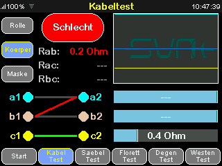

#### 12.6.6 Bedienhinweise zum erweiterten Drahttest

- Einstieg über den aktiven Kabeltest-Modus, über die zugehörige Schaltfläche oder über denselben unteren Modus-Button.
- Im erweiterten Modus werden Kanäle einzeln ausgewählt.
- Bei einem gültigen Paar wird der Widerstand direkt für dieses Paar dargestellt.
- Ein erneutes Verlassen des erweiterten Modus erfolgt über die Rückfläche oder durch Rückgeste.
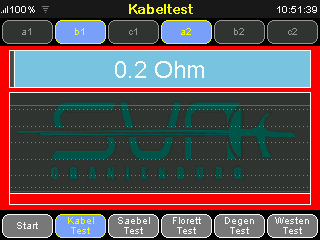

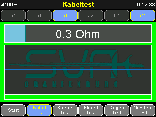

#### 12.6.7 Gezielte Fehlersuche mit dem erweiterten Modus

- Der erweiterte Modus eignet sich für die gezielte Suche nach Einzeldefekten.
- Werden zwei zusammengehörende Leitungsenden ausgewählt, erfolgt eine Durchgangsprüfung.
- Werden zwei nicht zusammengehörende Kanäle ausgewählt, erfolgt eine Isolationsprüfung.
- Damit kann gezielt unterschieden werden, ob ein Problem durch Unterbrechung, Übergangswiderstand oder Kurzschluss / Isolationseinbruch verursacht wird.
#### 12.6.8 Anschlussmatrix und Bewertung

- a1-a2, b1-b2, c1-c2 sollen im regulären Wire Test niederohmig sein.
- Verbindungen zwischen nicht zusammengehörenden Leitungen sollen hochohmig bleiben.
- OK bedeutet: Soll-Durchgänge liegen unterhalb des Verbindungsgrenzwerts und unerwünschte Querverbindungen bleiben oberhalb der Isolationsgrenze.
- Warnbereich bedeutet: Ein Wert bewegt sich noch nicht eindeutig in Richtung „Schlecht“, liegt aber bereits im eingestellten Warnfenster.
- „Schlecht“ bedeutet: Ein Soll-Durchgang ist zu hochohmig oder eine unerwünschte Verbindung ist zu niederohmig.
- In der grafischen Matrix werden gute Leitungsverbindungen und fehlerhafte Isolationspfade getrennt dargestellt.
- Die Balkenanzeige zeigt zusätzlich die drei Hauptdurchgänge als Einzelwerte.
#### 12.6.9 Was sehe ich im Balken

- Der Balken zeigt den aktuellen Messwert relativ zum eingestellten Plot-Maximum.
- Die Grenzmarke zeigt den jeweils relevanten Connection Threshold.
- Bei einem Durchgang ist ein kleiner Wert gewünscht.
- Bei einer Isolationsmessung ist ein möglichst großer Wert gewünscht.
- Der farbige Verlauf zeigt auf einen Blick, ob sich der aktuelle Messwert im „Gut“ Bereich, im Warnbereich oder in Richtung „Schlecht“ bewegt.
#### 12.6.10 Was sehe ich im Chart

- Das Chart zeigt die zeitliche Historie der letzten Messwerte.
- Dadurch werden kurze Kontaktprobleme, Wackler und reproduzierbare Fehler sichtbar.
- Ein ruhiger Verlauf spricht für einen stabilen Zustand.
- Sprünge, Zacken oder stark schwankende Verläufe sprechen für Kontaktprobleme oder bewegungsabhängige Fehler.
- Die Grenzlinie im Chart zeigt, ab wann ein Durchgang nicht mehr sicher OK ist.
#### 12.6.11 Worauf muss ich beim Durchgang achten

- Der Zahlenwert soll klar unterhalb des Connection Threshold liegen.
- Im Balken bedeutet das: der Messwert bleibt sicher im OK-Bereich.
- Im Chart bedeutet das: die Kurve bleibt stabil und springt nicht an die Grenzlinie heran.
- Werte im Warnbereich deuten auf Übergangswiderstand, Verschmutzung oder einen beginnenden Defekt hin.
- „Schlecht“ bedeutet, dass der Soll-Durchgang nicht mehr sicher gegeben ist.
#### 12.6.12 Worauf muss ich bei der Isolation achten

- Unerwünschte Verbindungen sollen deutlich oberhalb der Isolationsgrenze liegen.
- Kritisch sind niedrige oder schwankende Werte zwischen eigentlich getrennten Kanälen.
- In der Matrix werden solche Pfade als fehlerhafte Isolationsverbindung sichtbar.
- Im Chart weisen wiederkehrende Einbrüche oder kurze Spitzen nach unten auf einen intermittierenden Kurzschluss oder Verschmutzung hin.
#### 12.6.13 Typisch gut

- Die Soll-Verbindungen a1-a2, b1-b2 und c1-c2 bleiben stabil im OK-Bereich.
- Die Matrix zeigt keine unerwarteten Querverbindungen.
- Im Chart verläuft die Kurve ruhig und ohne Sprünge an die Grenzlinie.
#### 12.6.14 Typische Fehlerbilder

- Ein einzelner Pfad wird nur bei Bewegung „Schlecht“: typischer Hinweis auf Wackelkontakt oder Kabelbruch.
- Zwei Leitungen sind vertauscht: erwartete „Gut“ Verbindungen fehlen, während an anderer Stelle unerwartete Verbindungen erscheinen.
- Mehrere nicht zusammengehörende Kanäle zeigen geringe Isolation: typischer Hinweis auf beschädigte Isolation, Feuchtigkeit oder Schmutz.
- Ein Durchgang liegt dauerhaft im Warnbereich: typischer Hinweis auf verschlissene Stecker, Oxidation oder erhöhten Übergangswiderstand.
#### 12.6.15 Hold, Fading und Historie

Verzögertes „Gut“ / „Schlecht“ durch Hold und Fading:

- Die UI zeigt Zustandswechsel nicht immer nur als harten Sofortwechsel.
- Je nach Hold Mode bleiben erkannte „Gut“ oder „Schlecht“ Zustände noch kurz sichtbar.
- Positive Verbindungen und fehlerhafte Isolationspfade können dadurch verzögert ausblenden.
- Das hilft besonders bei kurzen Kontaktfehlern oder beim Bewegen des Prüflings, weil der relevante Zustand nicht sofort verschwindet.
Wie hilft der Farbergebnis-Balken:

- Der Farbergebnis-Balken verbindet den aktuellen Messwert mit seiner jüngeren Historie.
- Dadurch ist nicht nur der Momentanwert sichtbar, sondern auch, ob ein Wert gerade stabil ist oder aus einem früheren „Schlecht“ bzw. Warnbereich herauskommt.
- Bei aktiver Hold-/Fading-Logik bleibt eine auffällige Phase noch kurz nachvollziehbar.
- Das erleichtert die Fehlersuche bei kurzen Unterbrechungen, Prellern oder bewegungsabhängigen Kontaktfehlern.
Typische Verbindungsfehler und einfache Diagnose:

- Werden zwei Leitungen gegeneinander vertauscht, erscheinen die erwarteten OK-Verbindungen nicht an der richtigen Stelle.
- Stattdessen werden in der Verbindungsmatrix andere Pfade auffällig.
- Ein Beispiel ist ein Vertauschen von a und b: Dann bleibt z. B. a1-a2 nicht OK, während an anderer Stelle eine unerwartete Verbindung sichtbar wird.
- Die Verbindungsmatrix hilft hier besonders, weil sie nicht nur sagt, dass ein Fehler vorliegt, sondern auch, zwischen welchen Leitungen dieser sichtbar wird.
- Dadurch lässt sich oft schnell erkennen, ob eher eine Unterbrechung, eine Vertauschung oder eine unerwünschte Querverbindung vorliegt.
#### 12.6.16 Prüfablauf

Empfohlener Prüfablauf:

1. Passenden Untermodus Roll, Body oder Mask wählen.

2. Hauptverbindungen auf OK prüfen.

3. Bei Auffälligkeiten Matrix und Einzelbalken vergleichen.

4. Bei unklaren Fehlern in den erweiterten Modus wechseln.

5. Dort gezielt Kanalpaare für Durchgang oder Isolation prüfen.

6. Nach Reparatur oder Neuanschluss den regulären Modus erneut zur Gesamtbewertung verwenden.

### 12.3 Vest Test

#### 12.3.1 Zweck

- Prüfen des Übergangswiderstands bzw. der Leitfähigkeit der Weste
#### 12.3.2 Anschluss

- Die Weste bzw. der zu prüfende leitfähige Bereich wird an die dafür vorgesehene Westentest -Verbindung angeschlossen.
- Die Firmware kann mehrere mögliche Kontaktkombinationen erkennen und prüft deshalb verschiedene gültige Kanalpaare automatisch.
- Kontakte müssen sauber anliegen, damit keine falsche Unterbrechung erkannt wird.
- Es gibt zwei praktische Varianten:
- Variante 1: Anschluss an zwei beliebig gewählten Prüfpunkten der Weste.
- Variante 2: separater Vest-Anschluss mit zusätzlicher Farbanzeige und optionaler Vibrationsrückmeldung.
#### 12.3.3 Verhalten bei Anschlusswechsel und Prüfpause

Der Vest-Test arbeitet vollautomatisch. Der Nutzer muss keine Betriebsart auswählen.

#### 12.3.4 Verhalten der Anzeige

- Nach dem Anlegen der Prüfpunkte kann der erste gültige Messpunkt leicht verzögert erscheinen.
- Diese erste Verzögerung liegt typischerweise nur im Bereich von etwa 100ms.
- Wird der Anschluss gewechselt, erscheint die neue Bewertung nicht sofort.
- Die neutrale Anzeige erscheint nur während der automatischen Suche nach einem gültigen Anschlusspaar.
- Solange eine aktive Bewertung vorhanden ist, bleibt die Ergebnisanzeige sichtbar.
- Fällt ein zuvor gültiger Durchgang weg, bleibt die Anzeige zunächst auf Rot.
- Erst wenn für eine gewisse Zeit kein gültiger Durchgang mehr erkannt wird, wechselt das Gerät zurück in die automatische Suche.
- Dann erscheint die neutrale Anzeige.
- Wird in dieser Phase sofort ein neues gültiges Anschlusspaar gefunden, wechselt die Anzeige direkt in das neue Prüfergebnis.
- Wird kein neues gültiges Paar gefunden, bleibt die Anzeige neutral, bis wieder eine gültige Verbindung erkannt wird.
- Dieses Verhalten ist normal und dient einer stabilen Bewertung nach Anschlusswechsel oder kurzer Prüfunterbrechung.
#### 12.3.5 Anzeige und Bewertung

- Der Hauptwert wird als Widerstandsbar und Verlaufsgrafik angezeigt.
- Die Darstellung unterscheidet zwischen „Gut“, Warnbereich, „Schlecht“ und getrennt.
- Zusätzlich kann die Rückmeldung akustisch, per Vibration und über die externe LED-Anzeige erfolgen.
- Beim Suchen eines gültigen Anschlusspaars bleibt die Anzeige neutral.
- Sobald eine stabile Bewertung möglich ist, zeigt die Anzeige den Zustand farblich entsprechend dem Ergebnis.
#### 12.3.6 Was sehe ich im Balken und im Chart

- Der Hauptbalken zeigt den aktuellen Widerstand relativ zu Grenzwert und Plot-Maximum.
- Die Farbzonen helfen beim schnellen Erkennen von „Gut“, Warnbereich und „Schlecht“.
- Das Chart zeigt den zeitlichen Verlauf und damit auch kurze Aussetzer oder Kontaktbewegungen.
- Mit aktivem Hold Mode bleiben auffällige Zustände noch kurz sichtbar und blenden erst danach wieder aus.
#### 12.3.7 Typisch gut

- Die Anzeige wechselt nach kurzer Erkennung stabil in grün.
- Der Widerstand bleibt ruhig im OK-Bereich.
- Auch bei leichtem Bewegen der Prüfpunkte bleibt die Bewertung stabil.
#### 12.3.8 Typische Fehlerbilder

- Die Anzeige springt bei Bewegung zwischen grün, gelb und rot: typischer Hinweis auf verschlissene Kontaktflächen oder lokale Unterbrechungen.
- Die Anzeige bleibt oft neutral: typischer Hinweis auf fehlenden oder instabilen Kontakt zum Prüfling.
- Die Anzeige wird schnell rot: typischer Hinweis auf zu hohen Übergangswiderstand, verschmutzte Fläche oder defekte Anschlussstelle.
### 12.3.7 Prüfablauf

Empfohlener Prüfablauf:

1. Weste sicher anschließen.

2. Kurz abwarten, bis eine stabile Verbindung erkannt wurde.

3. Den Prüfstift systematisch über die Weste führen.

4. Den Prüfstift nicht zusätzlich aufdrücken, sondern nur mit der vorgesehenen Prüfkraft bzw. mit dem Eigengewicht arbeiten.

5. Vorder- und Rückseite der Weste prüfen.

6. Darauf achten, dass über die gesamte Fläche ein guter Durchgang vorhanden ist.

7. Bereiche mit Beschriftung oder Bedruckung sowie den Maskenlatz besonders sorgfältig prüfen, da hier erhöhter Verschleiß auftreten kann.

8. An Nähten achtsam prüfen.

9. Wenn die Prüfspitze beim Überfahren einer Naht kurz darüber springt, kann dadurch ungewollt kurz eine Unterbrechung entstehen.

10. Deshalb an Nähten möglichst nicht quer mit springender Spitze darüberfahren, sondern links und rechts entlang der Naht prüfen.

11. Hauptwert und Verlaufsanzeige beobachten.

12. Bei getrennt zuerst Anschluss und Kontaktfläche prüfen.

13. Bei Warnbereich oder „Schlecht“ Anschluss wiederholen und danach den Prüfling bewerten.

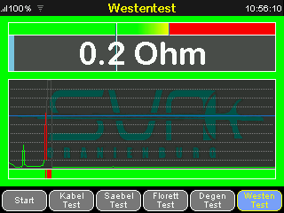

### 12.4 Säbel Test

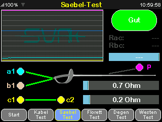

#### 12.4.1 Zweck und Besonderheiten

- Prüfen der relevanten Leitungs- und Kontaktpfade vom Säbel
- Darstellung der relevanten Leitungs- und Isolationspfade für den Säbeltest.
- Bewertung über Messbalken, Statusfarben und Ergebnisfeld.
- Zugang zu den Weapon-Test-Einstellungen per Geste oder Antippen.
#### 12.4.2 Allgemeiner Ablauf

1. Waffe / Waffenleitung korrekt anschließen.

2. Passenden Waffentest wählen.

3. Messpfade, Verbindungen, Kurzschlüsse und Zusatzpfade beurteilen.

4. Ergebnisanzeige „Gut“ / „Schlecht“ / --- beachten.

#### 12.4.3 Anschluss

- Die Säbel-Komponente bzw. der zugehörige Leitungsweg wird an die dafür vorgesehene Waffenverbindung angeschlossen.
- Für die Auswertung werden die Kanäle a1, b1, c1, c2 sowie der Zusatzkanal p verwendet.
- Generell liegt das Kabel auf der 1er-Seite; der Waffenanschluss bzw. die zusätzliche Prüfmöglichkeit wird passend auf der Gegenseite bzw. über p eingebunden.
#### 12.4.4 Anzeige und Bewertung

#### 12.4.5 Was sehe ich im Balken und im Chart:

- Die Balken zeigen die relevanten Haupt- und Zusatzwerte als Momentanwerte.
- Das Chart zeigt die zeitliche Entwicklung und hilft beim Erkennen instabiler Kontakte.
- Mit Hold Mode und Fading bleiben kurze „Schlecht“-Phasen noch sichtbar, auch wenn der Kontakt sich sofort wieder erholt.
#### 12.4.6 Typisch gut

- Hauptpfade und Zusatzpfade bleiben stabil im erwarteten Zustand.
- Die Klinge zeigt einen guten elektrischen Kontakt ohne auffällige Schwankungen.
- Oxidation oder lose Kontakte machen sich weder im Balken noch im Chart bemerkbar.
#### 12.4.7 Typische Fehlerbilder

- Schlechter Kontakt zur Klinge oder oxidierte Kontaktstellen führen zu erhöhtem Widerstand oder instabiler Anzeige.
- Unerwartete Querverbindungen deuten auf Verdrahtungsfehler oder fehlerhafte Isolation hin.
- Ein nur bei Bewegung auftretendes „Schlecht“ spricht oft für einen Wackelkontakt im Kabel- oder Waffenanschluss.
#### 12.4.8 Prüfablauf

1. Prüfling korrekt anschließen.

2. Sabre Test aufrufen.

3. Hauptverbindung und Zusatzpfade beobachten.

4. Isolationspfade und eventuelle Fehlverbindungen anhand der Anzeige bewerten.

5. Ergebnis „Gut“ oder „Schlecht“ für die Gesamtbeurteilung heranziehen.

### 12.5 Florett Test

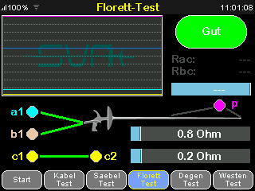

#### 12.5. 1 Zweck und Besonderheiten

- Prüfen der relevanten Leitungs- und Kontaktpfade des Floretts
- Neben dem regulären Messbild existiert ein Trigger-Untermodus.
- Der Trigger-Untermodus kann über den aktiven Seitenbutton oder die Bedienlogik des Modus aktiviert werden.
- Der Trigger Wert wird relativ zur eingestellten Trigger-Position bewertet.
- Die Trigger Anzeige eignet sich für das Beobachten des Auslöseverhaltens.
#### 12.5.2 Allgemeiner Ablauf

1. Waffe / Waffenleitung korrekt anschließen.

2. Passenden Waffentest wählen.

3. Messpfade, Verbindungen, Kurzschlüsse und Zusatzpfade beurteilen.

4. Ergebnisanzeige „Gut“ / „Schlecht“ / --- beachten.

#### 12.5.3 Anschluss

- Die Florett-Komponente bzw. der zugehörige Leitungsweg wird an die vorgesehene Waffenverbindung angeschlossen.
- Für die Auswertung werden die Kanäle a1, b1, c1, c2 und p verwendet.
- Generell liegt das Kabel auf der 1er-Seite; die Waffe bzw. die zusätzliche Prüfmöglichkeit wird passend auf der Gegenseite bzw. über p eingebunden.
#### 12.5.4 Anzeige und Bewertung

#### 12.5.5 Was sehe ich im Balken und im Chart

- Die Balken zeigen die aktuellen Messwerte für Hauptkontakt und Zusatzpfade.
- Das Chart zeigt, ob die Werte stabil OK bleiben oder kurzzeitig in Warnbereich oder „Schlecht“ springen.
- Bei aktiver Hold-/Fading-Logik bleiben kurze Auffälligkeiten noch kurz sichtbar.
#### 12.5.6 Typisch gut

- Die Verdrahtung der Spitze ist korrekt und die Anzeige bleibt im Ruhezustand stabil.
- Beim Auslösen schaltet der Kontakt klar und reproduzierbar um.
- Im erweiterten Modus ist kein unruhiges Mehrfachschalten sichtbar.
#### 12.5.7 Typische Fehlerbilder

- Die Spitze löst elektrisch nicht sauber aus: möglicher Hinweis auf verschmutzte Spitze, Kontaktproblem oder fehlerhafte Verdrahtung.
- Die Anzeige springt beim Betätigen mehrfach: typischer Hinweis auf Prellen oder mechanisch instabile Kontaktteile.
- Zusatzpfade über p zeigen kein erwartetes Verhalten: möglicher Hinweis auf Verdrahtungsfehler in der zusätzlichen Prüfmöglichkeit.
#### 12.5.8 Erweiterter Modus

- Zusätzlich steht ein erweiterter Modus für die Kontaktauslösung zur Verfügung.
- Dieser Modus dient zum Beobachten des Umschaltverhaltens des Kontakts.
- Damit lässt sich auch prüfen, ob der Kontakt sauber auslöst oder prellt.
Es wird mit erhöhter Abtastrate gearbeitet, bei einen Signalwechsel Gut zu Schlecht oder Schlecht zu Gut bleibt dieses Ereignis an der Triggerposition stehen. Es ist somit sehr gut möglich das Auslöseereignis kurz vor und nach der Auslösung zu begutachten.

Eine Berührung des Chart Bereiches setzt die gestoppte Messung wieder fort.

#### 12.5.9 Prüfablauf

Regulärer Prüfablauf

1. Prüfling korrekt anschließen.

2. Foil Test aufrufen.

3. Hauptkontakt, Zusatzleitung und relevante Isolationspfade beobachten.

4. Balken-, Wert- und Ergebnisanzeige gemeinsam bewerten.

5. Bei Auffälligkeiten Anschluss und Kontaktzustand erneut prüfen.

Prüfablauf im erweiterten Modus

1. Erweiterten Trigger-/Kontaktauslösemodus aktivieren.

2. Kontakt betätigen und die zeitliche Widerstandsveränderung beobachten.

3. Auf einen klaren, reproduzierbaren Umschaltpunkt achten.

4. Mehrfaches kurzes Umschalten, unruhige Verläufe oder schnelles Wechseln zwischen „Gut“ und „Schlecht“ deuten auf Prellen oder Kontaktprobleme hin.

5. Nach der Detailprüfung wieder in den regulären Modus zurückkehren und die Gesamtfunktion bewerten.

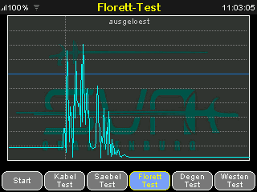

### 12.6 Degen Test

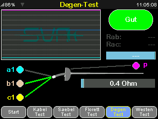

#### 12.6.1 Zweck und Besonderheiten

- Prüfen der relevanten Leitungs- und Kontaktpfade vom Degen
- Entspricht grundsätzlich dem Foil-Ablauf mit eigener Trigger-Beurteilung.
- Auch hier ist ein Trigger-Untermodus verfügbar.
- Die Parameter für Grenzwert, Plot und Trigger-Position stammen aus den gemeinsamen Weapon-Test-Einstellungen.
#### 12.6.2 Allgemeiner Ablauf

1. Waffe / Waffenleitung korrekt anschließen.

2. Passenden Waffentest wählen.

3. Messpfade, Verbindungen, Kurzschlüsse und Zusatzpfade beurteilen.

4. Ergebnisanzeige „Gut“ / „Schlecht“ / --- beachten.

#### 12.6.3 Anschluss

- Die Degen-Komponente bzw. der zugehörige Leitungsweg wird an die vorgesehene Waffenverbindung angeschlossen.
- Für die Auswertung werden die Kanäle a1, b1, c1 und p verwendet.
- Generell liegt das Kabel auf der 1er-Seite; die Waffe bzw. die zusätzliche Prüfmöglichkeit wird passend auf der Gegenseite bzw. über p eingebunden.
#### 12.6.4 Anzeige und Bewertung

#### 12.6.5 Was sehe ich im Balken und im Chart

- Die Balken zeigen die aktuellen Haupt- und Zusatzwerte.
- Das Chart zeigt stabile Verläufe ebenso wie kurze Kontaktstörungen.
- Hold Mode und Fading helfen dabei, auch sehr kurze „Schlecht“- oder Warnbereich-Phasen noch zu erkennen.
#### 12.6.6 Typisch gut

- Der Hauptkontakt bleibt im Ruhezustand stabil und schaltet bei Betätigung eindeutig.
- Die Verdrahtung zur Glocke und zum Kontaktpfad zeigt das erwartete Verhalten.
- Im erweiterten Modus erscheint ein klarer Umschaltpunkt ohne unruhige Mehrfachereignisse.
#### 12,6,7 Typische Fehlerbilder

- Falsche Verdrahtung zur Glocke führt zu unerwarteten Zuständen oder fehlendem Schalten.
- Eine verschmutzte oder mechanisch verschlissene Spitze zeigt unruhige oder verzögerte Umschaltungen.
- Wiederholte kurze Wechsel zwischen „Gut“ und „Schlecht“ sprechen für Prellen oder einen instabilen Kontaktweg.
#### 12.6.8 Erweiterter Modus

- Auch im Degen-Test steht ein erweiterter Modus für die Kontaktauslösung zur Verfügung.
- Dieser Modus eignet sich für die Beurteilung von Schaltpunkt, Kontaktstabilität und Prellen.
Es wird mit erhöhter Abtastrate gearbeitet, bei einen Signalwechsel Gut zu Schlecht oder Schlecht zu Gut bleibt dieses Ereignis an der Trigger Position stehen. Es ist somit sehr gut möglich das Auslöseereignis kurz vor und nach der Auslösung zu begutachten.

Eine Berührung des Chart Bereiches setzt die gestoppte Messung wieder fort.

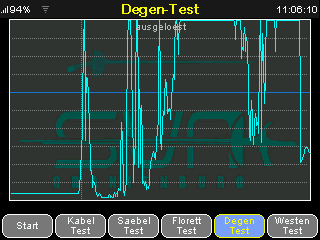

#### 12.6.9 Prüfablauf

Regulärer Prüfablauf:

1. Prüfling korrekt anschließen.

2. Epee Test aufrufen.

3. Hauptkontakt, Zusatzleitung und Isolation beobachten.

4. Hauptwert, Zusatzwert und Ergebnisanzeige gemeinsam bewerten.

5. Bei unklaren Ergebnissen Kontaktzustand und Anschluss erneut prüfen.

Prüfablauf im erweiterten Modus:

1. Erweiterten Trigger-/Kontaktauslösemodus aktivieren.

2. Kontakt auslösen und den gemessenen Verlauf beobachten.

3. Auf sauberes, einmaliges Umschalten ohne Mehrfachimpulse achten.

4. Wiederholte kurze Wechsel, unruhige Verläufe oder sichtbares Springen zwischen „Gut“ und „Schlecht“ sprechen für Prellen oder mechanische Kontaktprobleme.

5. Abschließend in den regulären Modus zurückkehren und die Gesamtbewertung prüfen.

## 13. Parameter

In den Parametern werden Mess- und Geräteeinstellungen festgelegt.

### 13.1 Parametergruppen

- Geräteeinstellungen
- allgemeine Messparameter
- Wire-Test-Parameter
- Weapon-Test-Parameter
- Vest-Test-Parameter
- Netzwerk- und Sicherheitsparameter
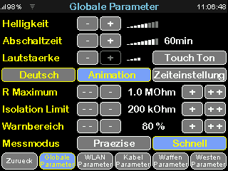

### 13.2 Geräteeinstellungen

Beschreibung:

- Helligkeit: Displayhelligkeit.
- Abschaltzeit: Zeit bis zum automatischen Abschalten des Geräts. Verfügbare Stufen reichen von 1 min bis 60 min sowie Nie.
- Lautstärke: Lautstärke der akustischen Rückmeldung.
- Uhrenmodus: Umschaltung zwischen analoger und digitaler Uhrdarstellung.
- Animation: aktiviert oder deaktiviert Seitenanimationen.
- Touch-Ton: aktiviert oder deaktiviert den Bedienton bei Touch-Eingaben.
- Sprache: Sprache der Geräte-UI.
### 13.3 Allgemeine Messparameter

#### 13.3.1 Beschreibung

- R Maximum: Obergrenze, bis zu der der Messbereich dargestellt wird.
- Isolation Limit: Untergrenze für die Bewertung einer unerwünschten Isolation / eines Fehlpfads.
- Warnbereich: Bereich vor der Fehlergrenze, in dem eine Warnanzeige erfolgt.
- Messmodus: Umschaltung zwischen Schnell und Präzise.
#### 13.3.2 Einfach erklärt

- R Maximum bestimmt die obere Darstellungsgrenze der Anzeige.
- Isolation Limit legt fest, ab wann eine eigentlich unerwünschte Verbindung kritisch wird.
- Warnbereich ist der Vorwarnbereich vor „Schlecht“.
- Ein eingestellter Wert von 80 % bedeutet: Bis 80 % des Weges zur Fehlergrenze gilt der Wert noch als unbedenklich.
- Ab diesem Punkt beginnt der farbliche Warnbereich als Übergang von grün zu gelb.
- Messmodus bestimmt, ob eher schnell oder eher besonders ruhig und genau bewertet wird.
### 13.4 Kabel-Test-Parameter

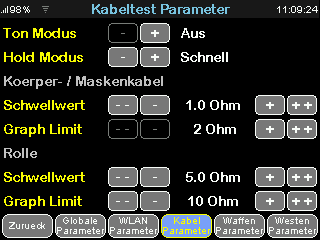

#### 13.4.1 Beschreibung

- Ton Modus: akustische Rückmeldung im Kabeltest.
- Hold Modus: Nachhalteverhalten der Anzeige für Kabeltest-Ergebnisse. Je nach Einstellung bleiben positive oder fehlerhafte Anzeigen noch eine Zeit sichtbar und klingen dann über die Fading-Logik wieder aus.
- Körper- / Maskenkabel: Parametergruppe für Körper- und Maskenkabel.
- Rolle: Parametergruppe für den Rollen-Untermodus.
- Schwellwert: Grenzwert für die jeweilige Messung.
- Graph Limit: oberes Plot-Ende für die jeweilige Darstellung.
#### 13.4.2 Einfach erklärt

- Ton Modus steuert die Tonausgabe.
- Hold Modus sorgt dafür, dass „Gut“ oder „Schlecht“ nicht sofort verschwinden.
- Schwellwert ist die Grenze zwischen noch gutem und zu hohem Widerstand.
- Graph Limit bestimmt, bis zu welchem Maximalwert Balken und Verlauf skaliert werden.
### 13.5 Waffen-Test-Parameter

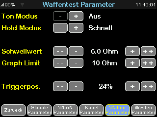

#### 13.5.1 Beschreibung

- Ton Modus: akustische Rückmeldung für Säbel, Florett und Degen.
- Hold Modus: Nachhalteverhalten der Waffenanzeige mit sichtbarer Verzögerung und Fading der Darstellung.
- Schwellwert: Grenzwert für die Waffenmessung.
- Graph Limit: oberes Plot-Ende für Waffentests.
- Triggerpos.: Schwellwertposition für die Trigger-Darstellung bei Florett und Degen.
#### 13.5.2 Einfach erklärt

- Ton Modus steuert die Tonausgabe.
- Hold Modus hält kurze Ereignisse noch kurz sichtbar.
- Schwellwert ist die Grenze für die elektrische Bewertung.
- Graph Limit bestimmt die Größenordnung der Anzeige.
- Triggerpos. legt fest, an welcher Stelle die Schaltschwelle in der Trigger-Anzeige liegt.
### 13.6 Vest-Test-Parameter

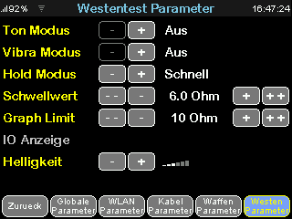

#### 13.6.1 Beschreibung

- Ton Modus: akustische Rückmeldung für den Westentest.
- Vibra Modus: Vibrationsrückmeldung gemäß eingestelltem Modus für Westentest-Ergebnisse.
- Hold Modus: Nachhalteverhalten der Westen-Anzeige. Sichtbare Zustandswechsel können je nach Einstellung verzögert ausblenden und dadurch besser beobachtet werden.
- Schwellwert: Grenzwert für die Weste.
- Graph Limit: oberes Plot-Ende für die Westen-Darstellung.
- Helligkeit: Helligkeit der externen Farbanzeige / LED-Rückmeldung im Vest-Test.
13.6.2 Einfach erklärt

- Ton Modus steuert die Tonausgabe.
- Vibrations-Modus bestimmt, ob und wie lange das Zubehör vibriert.
- Hold Modus hält kurze Zustände noch kurz sichtbar.
- Schwellwert ist die Grenze zwischen gutem und zu hohem Widerstand.
- Graph Limit bestimmt die Größenordnung der Anzeige.
- Helligkeit bestimmt die Helligkeit der externen Farbanzeige.
### 13.7 Netzwerk- und Sicherheitsparameter

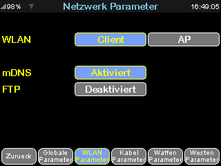

#### 13.7.1 Beschreibung

- WLAN-Modus: Off, Client oder Access Point.
- WLAN-Zugänge: mehrere speicherbare WLAN-Slots für bekannte Netze.*
- Gerätename: gemeinsamer Basisname für WLAN-Clientname, AP-Name und mDNS-Host.*
- DHCP oder statische Netzwerkkonfiguration.*
- mDNS: erleichterter Netzwerkzugriff über Namen statt IP-Adresse.
- FTP: optionaler Netzwerkdienst.
- Administrator-Passwort: Freischaltung geschützter Verwaltungsfunktionen.*
- Nur-Lese-Zugriff: erlaubt bei Bedarf nur eingeschränkten Zugriff ohne Administrator-Änderungen.*
#### 13.7.2 Einfach erklärt

- WLAN-Modus bestimmt, ob WLAN aus ist, ob das Gerät sich in ein vorhandenes WLAN einwählt oder selbst ein WLAN bereitstellt.
- WLAN-Zugänge sind gespeicherte bekannte WLAN-Zugänge.*
- Gerätename ist der Name, unter dem das Gerät im Netzwerk erscheint.*
- DHCP bedeutet automatische Vergabe der Netzwerkadresse.*
- statisch bedeutet: Adresse und weitere Netzwerkdaten werden fest eingetragen.*
- mDNS bedeutet: das Gerät kann oft über einen Namen statt über eine Zahlenadresse aufgerufen werden.
- FTP ist ein optionaler Dateizugriff über das Netzwerk.
- Administrator-Passwort schützt wichtige Einstellungen.*
- Nur-Lese-Zugriff erlaubt nur Lesen, aber keine Änderungen.*
> **Hinweis:**

- Parameter nur von eingewiesenen Anwendern ändern.
- Parameter beeinflussen Messbeurteilung, Bedienverhalten, Netzwerkverbindung und Wartungsfunktionen.
* nur in Browser Oberfläche änderbar

## 14. WLAN-Verbindung herstellen

Das Gerät unterstützt je nach Konfiguration:

- Client Mode
- Access Point (AP) Mode
Einfach erklärt:

- Client Mode bedeutet: das Gerät verbindet sich mit einem bereits vorhandenen WLAN.
- Access Point oder AP Mode bedeutet: das Gerät eröffnet selbst ein eigenes WLAN, mit dem sich Handy, Tablet oder Computer direkt verbinden können.
### 14.1 Client Mode

Im Client Mode verbindet sich das Gerät mit einem vorhandenen WLAN.

Bei erstmaliger Verbindung muss man sich per AP-Mode verbinden und der WLAN Zugangspunkt muss parametriert werden. Der Tester kann bis zu vier WLAN Zugänge nutzen, wobei er sich mit dem besten verbindet und bei Verbindungsverlust automatisch zum nächstbesten WLAN wechselt.

Allgemeiner Ablauf:

1. WLAN-Zugangsdaten am Gerät einstellen. Dies geht nur über Browser Oberfläche bei bestehender WLAN Verbindung, ggf. vorher per AP – Mode verbinden.

2. Verbindung starten.

3. Zugewiesene IP-Adresse ermitteln.

4. Web-App im Browser über die angezeigte Adresse aufrufen.

### 14.2 Access Point Mode

Im AP Mode stellt das Gerät selbst ein WLAN bereit.

Allgemeiner Ablauf:

1. AP Mode aktivieren.

2. Mit dem vom Gerät bereitgestellten WLAN verbinden.

3. Browser öffnen und die Web-App über die lokale Adresse aufrufen.

Hinweise:

- Reichweite und Stabilität hängen von der Umgebung ab.
- Beim Einsatz in störbehafteter Umgebung können Verbindungsabbrüche auftreten.
- WLAN ist nur für den bedarfsweisen Betrieb vorgesehen und in der Regel nicht dauerhaft aktiv.
## 15. Browser-Oberfläche aufrufen

Zusätzlich zur Bedienung am Gerät kann eine Browser-Oberfläche auf Handy, Tablet oder Computer verwendet werden.

### 15.1 Aufruf

- über IP-Adresse im Client Mode
- über lokale Adresse im AP Mode, z.B. http://192.168.4.1
### 15.2 Empfehlungen

- aktuellen Browser verwenden
- nach Firmware-Update die Seite neu laden
- bei Verbindungsproblemen Netzwerk und Browser-Cache prüfen
- für ändernde Verwaltungsfunktionen vorher anmelden
- beachten, dass für die Live-Steuerung immer nur ein verbundenes Bediengerät gleichzeitig vorgesehen ist
## 16. Web-App Bedienung

Die Browser-Oberfläche dient zusätzlich zur Anzeige, Einstellung und Wartung.

### 16.1 Allgemeiner Aufbau

- obere Navigationsleiste (Navbar) mit Direktzugriff auf Live-Test, Einstellungen, Info, Über, Sprachumschaltung, Theme-Umschaltung und Anmelden / Abmelden
- Standby-Indikator in der Navbar
- seitenweise gegliederte Konfigurations- und Informationsansichten
- geschützte Verwaltungsseiten für Konfiguration, Sicherheit, Neustart und OTA
### 16.2 Standby-Indikator in der Web-App

- In der Navbar wird die verbleibende Standby-Zeit des Geräts als kreisförmiger Fortschrittsindikator angezeigt.
- Bei Verbindungsverlust wird der Indikator in einen Offline-Zustand gesetzt.
- Relevante Benutzerinteraktionen in der Web-App senden Aktivität an das Gerät, damit der Standby-Timer zurückgesetzt werden kann.
### 16.3 Login und Rollen

- Ohne Anmeldung sind nicht alle Verwaltungsfunktionen verfügbar.
- Für sicherheitsrelevante oder ändernde Funktionen wie OTA, Netzwerkeinstellungen, Admin-Passwort, Import/Export oder Werksreset ist die Anmeldung erforderlich.
### 16.4 Live-Test

- Die Startseite der Browser-Oberfläche ist die Live-Ansicht Live-Test.
- Dort werden die aktuell aktiven Gerätemodi visualisiert.
- Verfügbar sind die Ansichten für Home, Kabel, Säbel, Florett, Degen und Westen.
- Der Wire-Test bietet auch in der Web-App den erweiterten Einzelpaar-Modus.
- Bei Foil und Epee wird der Trigger-Untermodus mit eigener Darstellung unterstützt.
- Die untere Modus Leiste der Live-Ansicht erlaubt den Seitenwechsel analog zur Geräte-UI.
- Zwischen analoger und digitaler Uhrdarstellung kann in der Home-Ansicht umgeschaltet werden.
### 16.5 Nur ein aktiver Client

- Für die aktive Live-Steuerung ist immer nur ein verbundenes Bediengerät gleichzeitig vorgesehen.
- Belegt ein anderer Browser bereits den Live-Zugriff, erscheint der Hinweis Gerät wird bereits verwendet.
- Nach Freigabe oder erneutem Laden kann der Zugriff erneut angefordert werden.
### 16.6 Settings-Seiten

- Gerät: Geräteeinstellungen wie Helligkeit, Abschaltzeit, Lautstärke, Uhr Modus, Animation und Touch-Ton.
- Messparameter: Messeinstellungen, also alle allgemeinen Messparameter sowie kabel-, waffen- und westenspezifische Parameter.
- Netzwerk: Netzwerkeinstellungen wie WLAN-Modus, gespeicherte WLAN-Zugänge, DHCP/statische IP, mDNS, FTP und Gerätename.
- Zeiteinstellungen: Zeiteinstellungen und Übernahme der lokalen Browser-Zeit.
- Sicherheit: Sicherheitseinstellungen wie Administrator-Passwort und optionaler Nur-Lese-Zugriff.
- Konfigurationsverwaltung: Verwaltung gespeicherter Einstellungen mit Export, Backup, Import und Werkseinstellungen.
- Firmware-Aktualisierung: Übertragen einer OTA-Datei und Anwenden des Updates.
- Neustart: manueller Neustart, falls gezielt benötigt.
### 16.7 Info-Seiten

- System: Firmware-, Hardware-, Speicher- und Laufzeitinformationen.
- Netzwerk: WLAN- und Schnittstellenstatus für Betrieb im vorhandenen WLAN oder im eigenen Geräte-WLAN.
- Konsole: Diagnose- bzw. Konsolenausgaben.
- Über: Hintergrundinformationen zum Projekt, zur Entstehung des Testers, zum Vereinsbezug, zur Dokumentation sowie zu Fehlerberichten und Diskussion.
- zusätzlich Zugriff auf Device-UI Screenshot anzeigen bzw. Device-UI Screenshot herunterladen zum Öffnen oder Herunterladen eines aktuellen Display-Screenshots im BMP-Format.
### 16.8 Parameter Handling Import/Export:

- Aktuelle Konfiguration herunterladen exportiert die aktuelle Konfiguration als JSON-Datei.
- Backup auf dem Gerät erstellen speichert eine Sicherungskopie auf dem Gerät.
- Gespeicherte Backup-Dateien können gelistet, heruntergeladen, gelöscht oder wieder eingespielt werden.
- Beim Import einer JSON-Datei werden Import-Kategorien ausgewählt, z. B. Gerät, Testparameter, WLAN und Admin.
- Der Import schreibt die gewählten Werte in die dauerhafte Konfiguration und startet das Gerät anschließend neu.
- Werkseinstellungen setzt die gespeicherte Konfiguration auf Werkseinstellungen zurück und führt ebenfalls einen Neustart aus.
> **Hinweis:**

- Die hauptsächliche Bedienung erfolgt weiterhin über das Gerät.
- Die Browser Oberfläche ergänzt die Bedienung, ersetzt sie aber nicht in allen Situationen.
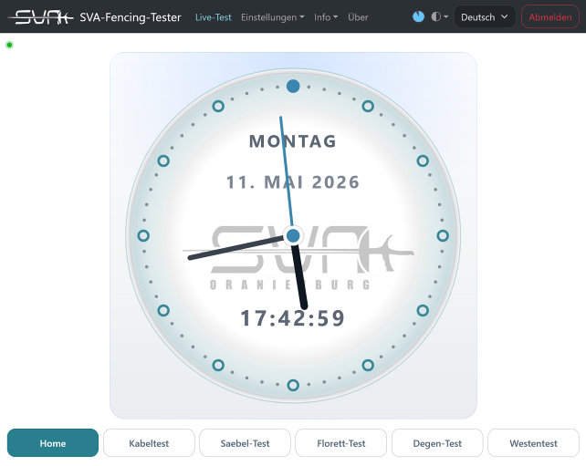

## 17. Firmware-Update

Firmware-Updates können über die Browser-Oberfläche eingespielt werden. Das Gerät benötigt dafür keinen eigenen Internetzugang; ein verbundenes Smartphone oder ein Computer übernimmt bei Bedarf den Download aus dem öffentlichen Projektportal.

Allgemeiner Ablauf:

1. An der Browser-Oberfläche anmelden.

2. Seite Firmware-Aktualisierung öffnen.

3. Für die aktuelle Freigabe "Neueste Version laden" wählen. Die Web-App lädt das vollständige Bundle über den Client, prüft dessen SHA-256-Prüfsumme und stellt es für die lokale Übertragung bereit.

4. Alternativ eine bereits gespeicherte OTA-Datei im Format .ota oder .ota.gz auswählen.

5. Update starten sowie Rückfragen und OTA-Optionen bestätigen.

6. Upload-Fortschritt abwarten.

7. Apply-Phase und automatische Prüfung / Übernahme abwarten.

8. Automatischen Neustart abwarten.

9. Nach dem Neustart Funktion prüfen.

Wichtige Hinweise:

- OTA-Updates sind nur nach erfolgreicher Anmeldung zulässig.
- Nur freigegebene Update-Dateien verwenden.
- Während des Updates keine Spannungsversorgung unterbrechen.
- Nach dem Update ggf. Browser neu laden.
- Das OTA-Format ist gerätespezifisch. Andere oder fremde Updateformate dürfen nicht verwendet werden.
Einfach erklärt:

- OTA bedeutet hier: die neue Firmware wird über WLAN und Browser an das Gerät übertragen, ohne das Gerät zu öffnen.
### 17.1 Rückfragen vor dem OTA-Start

Vor dem eigentlichen Update kann die Web-App zusätzliche Rückfragen stellen:

- Wenn die ausgewählte Datei bereits derselben Firmware-Version entspricht, wird eine Sicherheitsabfrage angezeigt.
- Wenn die ausgewählte Datei älter als die aktuell installierte Version erscheint, wird eine Downgrade-Bestätigung angezeigt.
### 17.2 OTA-Optionen

Verfügbare Option:

- Format webapp filesystem before update
Bedeutung:

- Bei aktivierter Option werden vorhandene LittleFS-Webapp-Dateien vor dem Einspielen gelöscht.
- Anschließend werden die im OTA-Paket enthaltenen Webapp-Dateien neu installiert.
- Diese Option ist sinnvoll, wenn Webapp-Dateien vollständig ersetzt oder Inkonsistenzen bereinigt werden sollen.
### 17.3 Verhalten während des OTA

Typischer Ablauf in der Web-App:

- Datei-Upload mit Prozentanzeige
- anschließende Apply-Phase ohne weitere Bedienung
- Hinweis, dass das Gerät währenddessen nicht ausgeschaltet oder zurückgesetzt werden darf
- automatischer Neustart nach erfolgreicher Übernahme
- erneutes Laden der Web-App, sobald das Gerät wieder erreichbar ist
### 17.4 Lokaler Service- und Programmierzugriff

Hinweise:

- Ein direkter lokaler Firmware-Zugriff ist nur bei geöffnetem Gerät möglich.
- Dieser Zugriff ist nicht für Benutzer vorgesehen.
- Beim ersten Prototyp ist der lokale Zugriff über USB nur bei geöffnetem Gerät und physischem Zugriff möglich.
- Bei zukünftigen Geräten ist ein lokaler Service- oder Programmierzugriff nur über einen Pico-Flex-Connector mit geeignetem Spezialadapter vorgesehen.
- Der lokale Zugriff ist ausschließlich für Entwicklung, Service oder autorisierte Eingriffe gedacht.
- Das Öffnen des Geräts darf nur durch geeignete und eingewiesene Personen erfolgen.
### 17.5 SD-OTA und Recovery

### Mit einer SD-Karte kann ein vollständiges OTA-Bundle ohne Netzwerk eingespielt werden. Der Ablauf eignet sich für Upgrade, Downgrade und die Wiederherstellung einer unvollständigen Webapp.

### SD-Karte vorbereiten:

### • SD- oder SDHC-Karte mit FAT/FAT32 formatieren; für Service und OTA sind 4 bis 32 GB empfohlen.

### • SDXC-Karten ab 64 GB funktionieren nur nach Formatierung als FAT32. Das übliche exFAT wird nicht unterstützt.

### • Das vollständige .ota-Bundle in das Stammverzeichnis der Karte kopieren und die Karte vor dem Einschalten einstecken.

### • Bei mehreren gültigen Bundles wählt das Gerät die höchste gefundene Version.

### Startdialog:

### • Nach dem Start erscheint bei einer passenden Datei für zehn Sekunden ein Dialog. „Start device“ setzt den normalen Start fort; die zweite Schaltfläche führt je nach Versionsstand Upgrade, Downgrade oder Recover aus.

### • Während des Updates das Gerät nicht ausschalten und die SD-Karte nicht entfernen.

### Downgrade-Sperre und Recovery:

### • Nach drei übersprungenen Downgrades wird dasselbe Bundle bei gesunder Webapp nicht mehr angeboten. Zum erneuten Anbieten die Datei /SVA_OTA_DISMISSED.txt im SD-Stammverzeichnis löschen.

### • /SVA_OTA_APPLIED.txt wird nach erfolgreicher Installation angelegt und verhindert erneute Angebote für dieselbe oder eine ältere Version auf demselben Gerät.

### • Die leere Datei /SVA_OTA_FORCE.txt erzwingt einmalig die Anwendung eines gültigen Bundles ohne Dialog. Sie wird vor dem Updateversuch gelöscht.

### Ausführliche Service- und Recovery-Hinweise stehen im öffentlichen Projektportal unter docs/manuals/sd_ota_recovery.md.

## 18. Pflege, Reinigung, Wartung und Lagerung

### 18.1 Reinigung

- Gerät nur im ausgeschalteten Zustand reinigen.
- Keine aggressiven Reiniger oder Lösungsmittel verwenden.
- Nur leicht angefeuchtetes, weiches Tuch verwenden.
### 18.2 Wartung

- Anschlüsse regelmäßig auf Verschmutzung und Beschädigung prüfen.
- Gehäuse, Display und Kabel auf mechanische Schäden kontrollieren.
### 18.3 Lagerung

- Trocken und vor direkter Sonneneinstrahlung geschützt lagern.
- Extreme Temperaturen vermeiden.
- Lithium-Akku nicht im tiefentladenen Zustand lagern.
### 18.4 Software- und Dateipflege

- Nach Parameter- oder Firmwareänderungen den Gerätestand dokumentieren.
- Bedienungsanleitung, Lizenzdatei und Firmwarestand sollten möglichst zusammenpassen.
- Bei Nutzung mehrerer Sprachfassungen auf denselben fachlichen Inhalt achten.
## 19. Fehlersuche

### 19.1 Gerät startet nicht

Mögliche Ursachen:

- Akku leer
- Ladeproblem
- Hardwarefehler
Maßnahmen:

- Gerät laden
- Ladezubehör prüfen
- Support kontaktieren
### 19.2 Keine Messanzeige / unplausible Messwerte

Mögliche Ursachen:

- Prüfling falsch angeschlossen
- Kontaktproblem
- Parameter falsch eingestellt
- Defekte Leitung / Waffe / Weste
Maßnahmen:

- Anschlussbild des gewählten Messmodus prüfen
- Stecker, Klemmen und Kontaktflächen auf festen Sitz und Sauberkeit prüfen
- Parameter und Grenzwerte mit dem vorgesehenen Prüfzweck abgleichen
- Bei unklaren Fehlern Verlauf, Balken und Verbindungsmatrix gemeinsam auswerten
- Falls vorhanden den erweiterten Modus zur gezielten Einzelprüfung verwenden
### 19.3 Keine WLAN-Verbindung

Mögliche Ursachen:

- falsche Zugangsdaten
- Reichweitenproblem
- AP / Client falsch konfiguriert
Maßnahmen:

- WLAN-Modus am Gerät prüfen
- Zugangsdaten und Netzwerknamen erneut kontrollieren
- Abstand zum Access Point verringern oder Störquellen ausschließen
- Nach Änderungen Gerät und Web-App neu verbinden
### 19.4 Web-App nicht erreichbar

Mögliche Ursachen:

- falsche IP-Adresse
- Browser-Cache
- Gerät noch nicht verbunden
- Netzwerkproblem
Maßnahmen:

- IP-Adresse oder Gerätenamen erneut prüfen
- Browser-Seite neu laden
- Bei Bedarf Browser-Cache leeren
- Prüfen, ob bereits ein anderer Client verbunden ist
- Netzwerkverbindung zwischen Gerät und Endgerät kontrollieren
## 20 FAQ und typische Praxisfragen

Warum zeigt ein Kabeltest nur beim Bewegen kurz „Schlecht“?

- Das ist ein typischer Hinweis auf Wackelkontakt, Kabelbruch, lockeren Stecker oder eine beschädigte Leitung.
- Im Chart zeigen sich solche Fehler meist als kurze Sprünge oder Aussetzer.
Warum bleibt die Vest-Anzeige nach dem Umsetzen kurz rot oder wird erst später neutral?

- Das gehört zum normalen automatischen Ablauf.
- Bei Verlust eines gültigen Kontakts bleibt das letzte fehlerhafte Ergebnis zunächst sichtbar.
- Erst nach einer kurzen Zeit ohne gültigen Durchgang wechselt die Anzeige in die neutrale Suchphase.
Wann ist ein kleiner Wert gut?

- Bei Durchgangsprüfungen ist ein kleiner Widerstand gut.
- Das bedeutet: die gewollte Verbindung leitet gut und hat nur wenig Übergangswiderstand.
Wann ist ein großer Wert gut?

- Bei Isolationsprüfungen ist ein großer Widerstand gut.
- Das bedeutet: zwischen zwei eigentlich getrennten Leitungen besteht keine unerwünschte Verbindung.
Wie erkenne ich vertauschte Leitungen?

- Die erwarteten OK-Verbindungen erscheinen nicht an der vorgesehenen Stelle.
- In der Verbindungsmatrix tauchen stattdessen andere oder unerwartete Pfade auf.
- So lässt sich häufig schon ohne Öffnen des Kabels erkennen, dass Adern vertauscht wurden.
Was bedeutet Warnbereich?

- Der Messwert ist noch nicht eindeutig „Schlecht“, liegt aber nicht mehr sicher im guten Bereich.
- Bei einer Einstellung von z. B. 80 % gilt der Bereich bis 80 % der Fehlergrenze noch als unbedenklich.
- Ab dort beginnt der farbliche Übergang von grün zu gelb als Warnbereich.
- Das ist oft ein frühes Zeichen für Verschleiß, Oxidation, Schmutz oder beginnende Kontaktprobleme.
Ersetzt das Gerät eine offizielle Waffenabnahme?

- Nein.
- Das Gerät ist für technische Prüfung, Vorbereitung und Fehlersuche gedacht.
- Die formale sportliche Freigabe richtet sich immer nach dem gültigen Regelwerk und der offiziellen Kontrolle.
Wofür ist die Zusatzbuchse p gedacht?

- Über p können je nach Modus zusätzliche oder ergänzende Prüfungen erfolgen.
- Dazu gehören zum Beispiel zusätzliche Kontaktprüfungen an der Waffe oder ergänzende Prüfungen des Kontaktwegs.
Warum erscheint manchmal erst nach kurzer Zeit ein erstes Ergebnis?

- Besonders beim Vest-Test kann der erste gültige Messpunkt leicht verzögert erscheinen.
- Diese kurze Verzögerung dient der stabilen automatischen Erkennung eines gültigen Anschlusspaars.
Kapitel 20.1: Messverfahren und Strombegrenzung

Der SVA Fencing Tester arbeitet nach dem Prinzip der voll-ratiometrischen Synchronmessung über ein hochohmiges, digitales ADC-Frontend. Der exakte Widerstandswert der Fechtausrüstung (\(R_{x}\) wird rein mathematisch über das Spannungsverhältnis zu einem internen, temperaturstabilen Präzisions-Referenzwiderstand ermittelt. Durch dieses ratiometrische Verfahren kürzen sich bauteilbedingte Toleranzen, Halbleiter-Drifts und Schwankungen der Versorgungsspannung mathematisch vollständig aus, wodurch das Gerät dauerhaft kalibrierungsfrei operiert.

Zur optimalen und materialschonenden Simulation der realen Fechtbahn verfügt das Gerät über eine fest integrierte, hardwareseitige Begrenzung des Prüfstroms. Je nach Hardware-Revision und ausgewähltem Prüfprofil gelten folgende Parameter:

## Der maximale Prüfstrom bei Kurzschluss (0 Ω) ist starr auf maximal 10 mA (40mA) begrenzt.

## Hinweis: Die schaltungstechnische Implementierung der Strombegrenzung und die Filterung der internen Spannungsdomänen sind proprietär und verbleiben zum Schutz des geistigen Eigentums Closed Source.

## 21. Technische Daten

- Abmessungen
- Gewicht
Cpu

ESP32-S3

Dual Core XTensa LX7 mit je 240MHz

512kB RAM, davon 64kB System Cache und 192kB IRAM

8MB/16MB FLASH (Octal SPI)

8MB PSRAM (Octal SPI)

- Display
2.8Zoll

320x240 Pixel mit 16Bit Farbtiefe (RGB565)

Resistiver Touch

LED Backlight

- Schutzart
IP1

- Betriebs- und Lagertemperatur
Betrieb: -20°C bis 60°C

Lagerung: -30°C bis 80°C

Akku: 0°C bis 45°C, nicht unter 0°C aufladen

Akku Lagerung: -10°C bis 50°C

- Akku
Lithium Ionen Polymer

3,7V / 1800mAh

Integrierte Schutzschaltung gegen Tiefenentladung, Überladung und Kurzschluss

Anschluss PH2, Polung bei Austausch unbedingt beachten

- Ladeanschluss
USB-C

nur 5V

min 1A empfohlen, 400mA Ladestrom zuzüglich Verbrauch durch Gerät

- WLAN
2,4-GHz 802.11 b/g/n

bis zu 150 Mbps mit 40MHz Bandbreite

WPA/WPA2/WPA3 kompatibel

Nur bei Bedarf aktiv

## 22. Elektrische Daten

- Versorgungsspannung
5V DC über USB-C

- Prüfspannung
4 V

- maximaler Prüfstrom
konstruktiv auf 40 mA begrenzt

Strombegrenzung über Shunt

- Schutzbeschaltung
Messeingänge gegen ESD und Fehlpegel ab 5.1V

- Ladestrom
400 mA

- Stromaufnahme
maximal 1A bei gleichzeitiger Ladung

- Messgrenzen
0.1Ω bis 2MΩ (intern 0.01Ω bis 10MΩ)

> **Wichtig:**

- Keine Fremdspannung anschließen.
## 23. Drittanbieter-Komponenten und Lizenzen

Das Produkt verwendet Drittanbieter-Komponenten mit Open-Source-Lizenzen. Firmware und Webapp selbst sind proprietär und nicht quelloffen.

### 23.1 Firmware / Toolchain

| Komponente | Lizenz |
| --- | --- |
| PlatformIO espressif32 via pioarduino | Apache-2.0 |
| Arduino-ESP32 Framework | LGPL-2.1-or-later |
| Arduino-ESP32 Framework Libraries | LGPL-2.1-or-later |
| mklittlefs | MIT |

### 23.2 Verwendete Bibliotheken Firmware

| Komponente | Lizenz |
| --- | --- |
| PsychicHttp | MIT |
| ESP-FTP-Server-Lib | MIT |
| TaskScheduler | BSD-2-Clause |
| ArduinoJson | MIT |
| ADS1115 | MIT |
| ESP32Time | MIT |
| CRC | MIT |
| DS3232 | MIT |
| I2C_EEPROM | MIT |
| htcw_rmt_led_strip | MIT |
| XPT2046_Touchscreen_TT | MIT |

23.3 Verwendete Bibliotheken Browser Oberfläche

| Komponente | Lizenz |
| --- | --- |
| Vue | MIT |
| Vue Router | MIT |
| Vue I18n | MIT |
| Bootstrap | MIT |
| bootstrap-icons-vue | MIT |
| @popperjs/core | MIT |
| Mitt | MIT |
| Pulltorefreshjs | MIT |
| sass-embedded | MIT |
| TypeScript | Apache-2.0 |
| Terser | BSD-2-Clause |
| Knip | ISC |

> **Hinweis:**

- Lizenztexte und Pflichtangaben sollten im finalen Lieferumfang bzw. in einem separaten Lizenzdokument bereitgestellt werden.
## 24. Entsorgung

- Elektronische Geräte nicht über den Hausmüll entsorgen.
- Den enthaltenen Lithium-Akku gemäß den geltenden Vorschriften entsorgen.
- Nationale und regionale Entsorgungsvorschriften beachten.
Hinweise:

- Akkus nach Möglichkeit getrennt vom Gerät entsorgen, sofern dies für Service oder Recycling vorgesehen ist.
- Beschädigte oder aufgeblähte Akkus mit besonderer Vorsicht behandeln.
- Elektroaltgeräte an geeigneten Sammelstellen oder entsprechend den lokalen Vorschriften abgeben.
## 25. Kontakt / Service / Herstellerangaben

[Hier Hersteller, Kontakt, Serviceadresse, Webseite, E-Mail und ggf. Seriennummernschema ergänzen]
