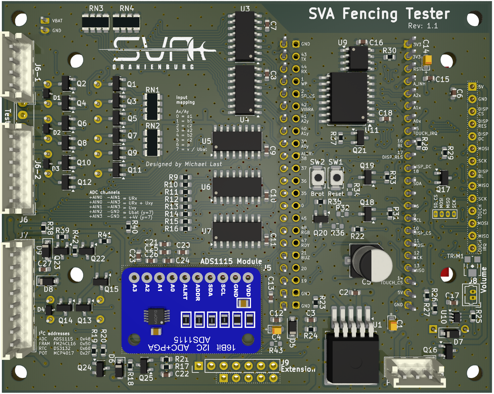
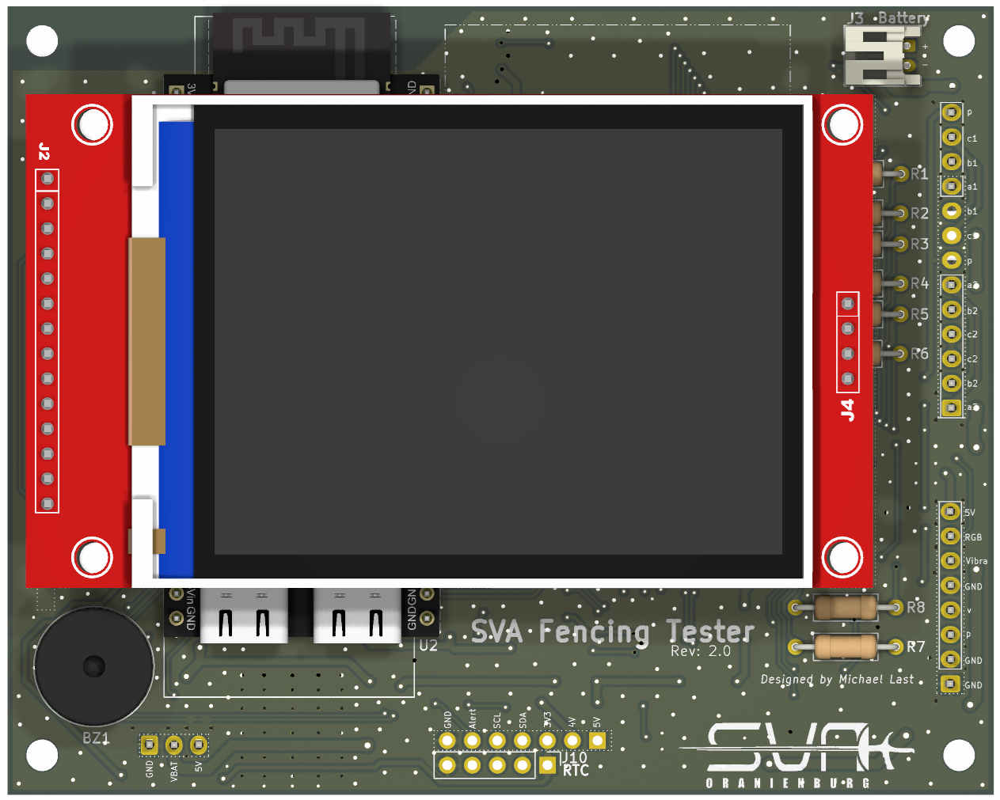

# PCB – Revision 2

| Ansicht | Datei |
| --- | --- |
| Bestückungsseite | [pcb-rev2-top.png](./pcb-rev2-top.png) |
| Display-/Frontansicht | [pcb-rev2-display.png](./pcb-rev2-display.png) |

Die Renderings zeigen Revision 2 zur visuellen Identifikation. Sie enthalten keine editierbaren PCB-, Schaltplan- oder Fertigungsdaten.

Das vollständige 3D-Modell für Gehäuse-CAD ist unter [sva-fencing-tester-rev2.step](../../models/sva-fencing-tester-rev2.step) verfügbar.

