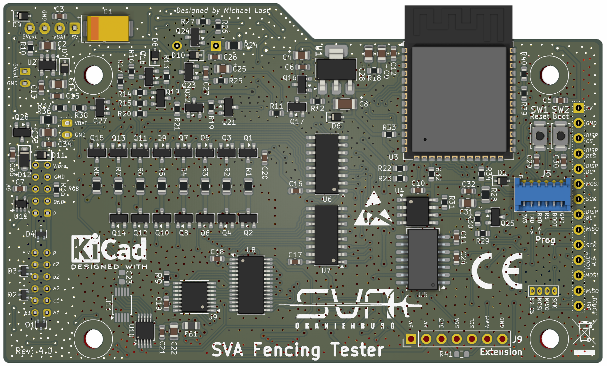

# PCB – Revision 4

| Ansicht | Datei |
| --- | --- |
| Bestückungsseite | [pcb-rev4-top.png](./pcb-rev4-top.png) |
| Display-/Frontansicht | wird nachgereicht |

Die Renderings zeigen Revision 4 zur visuellen Identifikation. Sie enthalten keine editierbaren PCB-, Schaltplan- oder Fertigungsdaten.

